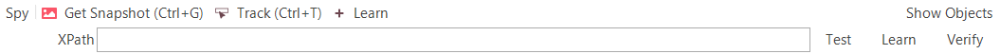

# Web Spy

## Purpose

The **Web Spy** is used to inspect web applications running on any of the supported web browsers (currently Internet Explorer, Firefox, and Chrome). It allows you to view the hierarchy of elements in the web browser **Document Object Model (DOM)**. Additionally, it simplifies the testing of dynamic, data-driven web applications by letting you test out dynamic [XPath](xpath.md) or [CSS](css.md) queries against the web page and verify that the returned elements match your expectations.

The **Web Spy** dialog displays a hierarchical representation of the HTML DOM elements that make up the web application being tested, as well as the properties of the currently selected object. You can select an object by clicking on its representation in the object hierarchy displayed on the left. The displayed properties are categorized into different types, which are described below.

The **Web Spy** also allows you to visually highlight an item in the web browser by selecting it in the object hierarchy, and vice-versa—selecting an object in the hierarchy by clicking on its representation in the web browser.

## Spy Toolbar

The Web Spy toolbar provides the following tools:

- **Get Snapshot (Ctrl+G):** Clicking this command refreshes the contents of the DOM Tree. This should be done whenever the state of the web page changes in the web browser and you want to view how the DOM objects have been affected.
- **Track (Ctrl+T):** This tool allows you to select items in the web application (as rendered by the web browser) and have the corresponding object selected in the DOM tree window. This is useful if you are unsure where an item is located in the DOM tree but can see it in the browser.
- **Learn:** Clicking this tool adds the currently selected object to the [Object Tree](object_tree.md) for the current test. It can then be used as a scriptable object in the test script. When you click the Learn button, a dropdown list provides the choice of learning the object by its **XPath** or **CSS** properties.
- **XPath:** This field is described separately below in the **Test Results** section. This tool allows you to try out different XPath queries to see which objects match. You can then learn the results of these queries as new Rapise objects.

## Spy Menu

Additional tools are available in the menu.

{width="392px"}

- **Go To Url:** Allows entering a URL and performing navigation in a remote browser. This is handy when connecting to desktop browsers via Selenium or mobile browsers via Appium.
- **Disconnect:** Closes the connection to the browser and clears the DOM tree.
- **Save:** Used to save the DOM tree to an XML file.
- **Load:** Used to load the DOM tree from an XML file.
- **Hide Invisible:** Hides all elements with zero dimensions or `display: none` style from the DOM tree.
- **Highlighting Mode:** When this is selected, selecting an object in the DOM Tree highlights the item in the rendered web page with a red square. This allows you to visually see an item in the DOM tree and how it appears to the user.
- **Virtual Mode:** When virtual mode is **on**, you can test XPath queries with the DOM tree loaded into Spy (the browser is not used). For example, you can load the tree from an XML file.
- **CSS Enabled:** Select this to make the CSS test field visible on the toolbar.
- **Web Spy Settings:** Clicking this brings up the [Web Settings](web_settings.md) dialog box.

## Spy Shortcuts

- ++ctrl+g++ - reloads the DOM tree from the active page in the browser.
- ++ctrl+t++ - starts/stops tracking mode to locate the element in the DOM tree.
- ++ctrl+shift+t++ - saves a snapshot of the DOM tree. When this shortcut is pressed, Rapise prompts for a name and saves the DOM tree in XML format and a screenshot of the browser window in PNG format.

## DOM Tree

The DOM tree allows you to view all HTML elements (also known as DOM elements) that comprise the web application/web page being tested. The elements are shown in a hierarchical tree representation that mirrors how they are nested on the page. Each element is displayed along with its associated attributes (class, id, style, etc.):

{width="526px"}

The DOM elements are color-coded.

- Tags and text are gray 

- Attribute names are red 

- Attribute values are blue 

- Elements that are not displayed on screen due to zero size or `display: none` style are emphasized with lighter colors.

Sometimes, more attributes are displayed than can be easily read. To make viewing the DOM tree easier, you can use the [Web Settings](web_settings.md) dialog to specify a list of attributes that should be excluded from the DOM tree pane.

When you right-click an element, a popup menu opens with the following options:

- **Copy** - copies node text to the clipboard (no attribute truncation).
- **Highlight** - highlights the element in the browser.
- **Learn** - expands the list of [various XPath locators](web_settings.md#different-types-of-xpath) generated for the element. Click an item in this list, and Rapise will learn the object with the selected XPath.

Double-clicking an element copies its [XPath](xpath.md) to the toolbar.

## DOM Element

When you click an element in the DOM tree, its properties are displayed in the **DOM Element** pane, and it is highlighted in the web browser.

{width="491px"}

The displayed properties are grouped into the following categories:

- **Primary**
    - tagName - contains the name of the HTML element.
    - text - contains a textual representation of all HTML text nodes inside this element (if any).
- **Attributes** - All DOM attributes appear here. These attributes are shown in red in the DOM tree. Examples:
    - id - contains the ID of the DOM element, if specified on the page.
    - style - contains the inline styles defined for the element.
    - class - contains the list of CSS classes applied to the element (separated by spaces if more than one).
- **Properties** - contains the computed positional information about the element.
    - height
    - width
    - x
    - y
    - zIndex
- **Selectors** - This section contains [XPath](xpath.md) and [CSS](css.md) selectors computed using different algorithms. If you double-click a selector's name, it will be copied to the edit field on the toolbar.

## Test Results

In addition to navigating the DOM tree and learning specific elements, the other main capability of the Web Spy is the ability to create queries using either [XPath](xpath.md) or [CSS](css.md) to see which objects match the query and then learn the specific result. For example, we want to find all table cells that have at least some style information specified.

### Using XPath

Enter the [XPath](xpath.md) query to locate the table cells in the **XPath** box at the top.

{width="689px"}

When you click **Test**, it will display all DOM elements that match the query:

{width="265px"}

You can then refine the query to find only the items you want to test.

!!! note
    If you need to enter a non-breaking space (nbsp) in your search query, you can do this by pressing the ++shift+space++ key combination.

### Using CSS

Enter the [CSS](css.md) selector to locate the table cells in the **CSS** box at the top (if the box is not visible, use the menu `Spy > CSS Enabled`).

{width="634px"}

When you click **Test**, it will display all DOM elements that match the query:

{width="271px"}

You can then refine the query to find only the items you want to test.

In either case, if you can adjust the query to match only a single element, you can then click the appropriate **Learn** button next to the **XPath** or **CSS** edit fields. This will learn the specified query as a new object that can be scripted against in Rapise. This is very useful if you want to dynamically select an object based on its content rather than a hard-coded ID or position. Additionally, you can add an assertion to the test by clicking **Verify**. This will display [properties of the object](verify_object_properties.md). You can set checkboxes next to properties you want to check during playback.

Additionally, in the test results view, when you click a result:

- The right-click popup menu is the same as for the DOM Tree if the result is a DOM Element.
- If the result is simple text, then only **Copy** is available, which copies the text.
- Clicking a DOM element in the results list opens it in the DOM Element pane and also selects it in the DOM Tree pane.

## Maintenance Mode

Since Rapise **version 6.2**, it is easier to check and update object locators. If you launch the spy, it will show the object tree in the right-side panel. You can toggle visibility for the object tree using the `Show/Hide Objects` button in the top-right corner of the spy.

To check an object locator, simply select the object in the object tree. The result of the locator test is indicated by an icon.

{width="194px"}

If an object is found, it will be highlighted in the browser and selected in the tree of application objects (left pane).

To fix a locator for an object that is not found, do the following:

1. Select the object in the object tree (right pane).
2. Select the element by:
    - testing the XPath locator from the toolbar
    - or directly in the DOM tree (left pane)
    - or by using object tracking.
3. Press the relearn button on the toolbar.

## See Also

- [Object Spy](object_spy.md)
- [Save DOM tree to share with Rapise experts](https://www.inflectra.com/Support/KnowledgeBase/KB422.aspx)