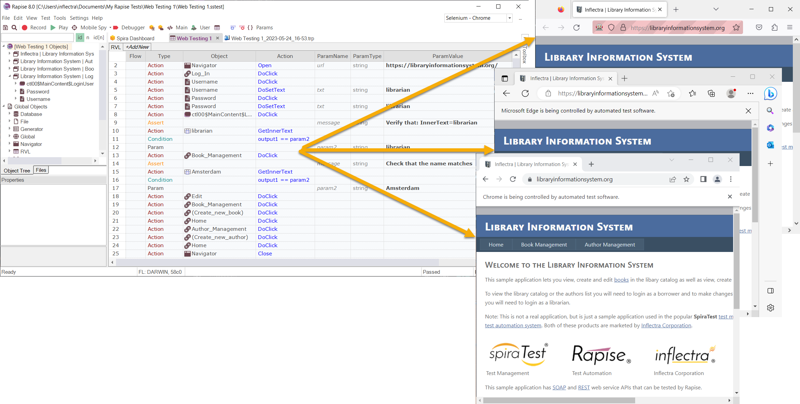

# Web Testing

## Purpose

Rapise lets you record and play automated tests against web applications on a variety of web browsers including **Firefox**, **Internet Explorer** and **Google Chrome**. Rapise lets you record or create your tests against one browser and then play the same test back against all of the other browsers. It is called **Cross Browser Testing**.

Some of the web browsers will require the [installation of a special Rapise plugin](setting_up_web_browsers.md) to allow automated testing.

Rapise provides comprehensive support for testing Web applications. It uses the web browser Document Object Model (DOM) to interact with the current web page. The various web browsers on the market have various differences in DOM implementation. In many cases these differences are not significant. But sometimes they require special handling. Rapise tries to overcome the differences and make the recorded scripts as universal as possible.

In addition, it is possible to have more control over the cross browser execution using the available APIs and configuration variables. You can also run the recording in multiple browsers in succession using either a Rapise [sub-test](tests_and_sub_tests.md) or simply executing the test from our [SpiraTest test management](spiratest_integration.md) system and passing through different parameter values.

## DOM API

In addition to the usual [recording](recording.md), [learning](learn_object.md) and [playback](playback.md) that is similar to testing other technologies (desktop, mobile, etc.) there are some unique functions that are available on all recorded web objects. Upon learning a web element in Rapise, you get an object of type [HTMLObject](/Libraries/HTMLObject/). Each **HTMLObject** provides set of functions to facilitate the cross-browser access to web element parents and children.

- **DoDOMChildAt** - Returns n-th child (zero-based).
- **DoDOMChildrenCount** - Returns number of children elements for this one.
- **DoDOMFindParentWithAttribute** - Returns parent element with given attribute matching given string or regex.
- **DoDOMGetAttribute** - Returns specified attribute.
- **DoDOMNextSibling** - Returns next sibling element for this one.
- **DoDOMParent** - Returns parent element having this element.
- **DoDOMPrevSibling** - Return previous sibling element for this one.
- **DoDOMRoot** - Returns Root element having this element.
  
## See Also

- [Web Browser Profiles](browser_settings.md) - How to configure browsers to record and playback tests via Rapise native connectors.
- [Selenium Profiles](selenium_settings_dialog.md) - How to configure Rapise to playback tests on Selenium nodes.
- [Web Spy](web_spy.md) - How to use the Web Spy to inspect web pages and dynamically query for HTML elements.
- [Web Application Profile](web_app_profile.md) - How to improve automatic generation of Web element locators.
- [Self-healing Web Locators](web_self_healing.md) - How to enable and use advanced maintenance features for Web testing.
- [XPath](xpath.md) - An explanation of the XPath language, how it can be used to dynamically query objects in web application and some examples.
- [CSS](css.md) - An explanation of how to use CSS selectors (common in frameworks such as jQuery) to dynamically query objects in web applications.
- [Web Testing Tutorial](tutorial_record_and_playback.md) - a basic example of how to record, learn and playback tests using a our sample web application.
- [Setting up Web Browsers](setting_up_web_browsers.md) - describes the steps needed to configure each of the web browsers to work with Rapise.
