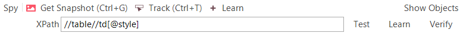
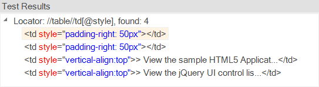

# Web Testing - Using XPath Queries

## Purpose

When testing web applications you will often need to use XPath to query the browser DOM for elements based on the scenario under test. This section explains how you can use XPath queries with Rapise to make your browser testing more flexible and adaptive to changes on the screen.

## XPath Fundamentals

XPath uses path expressions to select nodes in an XML document such as HTML. The node is selected by following a path or steps.

[XPATH Tutorial](https://www.w3schools.com/xml/xpath_intro.asp)

## Rapise XPath Extensions

Web pages sometimes use HTML frames. The XPath works inside the frame contents. Rapise has a special syntax (that is not part of standard
XPath) to combine multiple XPath statements into a single line:

```xpath
//frame[@name='main']@@@//a[3]
```

The special statement `@@@` is used as a separator for XPath statements pointing to constituent frames.

The top-level frame is found by name 'main'

```xpath
//frame[@name='main']
```

Then the frame's contents are searched for the third `<a>` element (i.e. 3rd link on a page).

There are several different ways to use XPath queries in Rapise

## Using Web Spy

To most easily use XPath queries in Rapise, we recommend using the Web Spy tool:



If you enter in the XPath query at the top, when you click **Test** it will display all of the DOM elements that match the query:



You can now refine the query to only find the items you want to test.

## Learning Objects

When you have created the query in the Web Spy that returns the HTML elements that you were expecting, you can click on the **Learn** button to learn that object. What this will do is create a new Rapise object in the [Object Tree](object_tree.md) that maps to this specific XPath. That means that the "object" in Rapise is effectively a pointer to this specific XPath query.

For example, if you want to find a specific book in a grid of books, you can search by its name using XPath and the text() XPath expression described above, then learn this object as **Oliver_Twist** so that you can access it in your code as `SeS("Oliver_Twist")`. Every time you call a function on **Oliver_Twist**", Rapise will use the learned XPath expression and use that to evaluate which HTML element in the web page to access.

## Dynamic Queries

In addition to learning objects based on specific XPath, there are a set of general functions that can be used to query for objects in the web page:

```javascript
SeS('Book_Management').DoDOMQueryXPath('tr/td[text()="Oliver Twist"]');
```

Will dynamically query for any HTML element that is a child of the learned **Book Management** object that matches the XPath. In this example it will look for any table cell in a table row that has the content of the book name.

## See Also

- [KB282](https://www.inflectra.com/Support/KnowledgeBase/KB282.aspx) Elastic XPATH Expressions