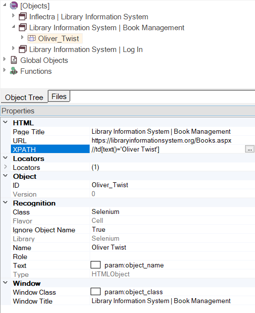

# Web Testing - Using XPath Queries

## Purpose

When testing web applications you will explicitly or implicitly use **XPath** expressions to query the browser **DOM** for elements based on the scenario under test. This section explains how XPath queries are used in Rapise and how to make your browser testing more flexible and adaptive to changes in the application you test.

## XPath Fundamentals

XPath uses path expressions to select nodes in an **XML** document such as **HTML**. The node is selected by following a path or steps.

Refer to [XPATH Tutorial](https://www.w3schools.com/xml/xpath_intro.asp) for more details.

## Rapise XPath Extensions

### Frames

Web pages sometimes use **HTML** frames. The XPath works inside the frame contents. Rapise has a special syntax (that is not part of standard XPath) to combine multiple XPath statements into a single line:

```css
//frame[@name='main']@@@//a[3]
```

The special statement `@@@` is used as a separator for XPath statements pointing to constituent frames.

The top-level frame is found by name `main`

```css
//frame[@name='main']
```

Then the frame's contents is searched for the `<a>` element that is a 3d child of it's parent element.

```css
//a[3]
```

!!! note
    Segments of a locator separated by `@@@` can be both [xpath](xpath.md#frames) and [css](css.md#frames). For example the following locators are equivalent:

    ```css linenums="1"
        css=frame[name='main']@@@css=a:nth-of-type(3)
        //frame[@name='main']@@@//a[3]
        //frame[@name='main']@@@css=a:nth-of-type(3)
        css=frame[name='main']@@@//a[3]
    ```

### Shadow DOM

Another XPath extension is related to [Shadow DOM](https://developer.mozilla.org/en-US/docs/Web/API/Web_components/Using_shadow_DOM). It's borders are typically closed for XPath. In such a case a locator for an element inside Shadow DOM has two parts separated by `@#@` delimiter. First part (can be XPATH or CSS) should point to the Shadow Root in the Light DOM. Second part (always CSS) should point to a child element of the Shadow Root. In the case of nested Shadow DOMs there will be multiple `@#@` delimiters.

Example of a locator:

*automatically built by WebSpy*
```css
/html/body[1]/section[1]/div/guid-generator[1]@#@css=input:first-of-type
```
*after manual editing*
```css
//guid-generator@#@css=input
```

Find the example of a simple page with Shadow DOM on [UI Testing Playground](http://uitestingplayground.com/shadowdom).

## Automatic XPath Generation on Record and Learn

When you do a [recording](recording.md) session, interact with web elements or [learn](object_learning.md) them - Rapise generates XPath [locators](https://www.inflectra.com/Support/KnowledgeBase/KB289.aspx) for the elements. You can view XPath of an object in the property grid:

{width="412px"}

## Usage

### In Web Spy

In some advanced cases you may need to construct XPath query manually. For this purpose we recommend using the [Web Spy](web_spy.md) tool:

{width="622px"}

If you enter in the XPath query at the top, when you click **Test** it will display all of the DOM elements that match the query:

{width="434px"}

You can now refine the query to only find the item you want to test.

When you have created the query in the Web Spy that returns the HTML element that you were expecting, you can click on the **Learn** button in the Web Spy toolbar to learn that element. What this will do is create a new Rapise object in the [Object Tree](object_tree.md) that maps to this specific XPath.

For example, if you want to find a specific book in a grid of books

{width="718px"}

you can search by its name using `text()` XPath function:

```xpath
//td[text()='Oliver Twist']
```

Then learn this object as **Oliver_Twist** so that you can access it in your code as `SeS("Oliver_Twist")`. Every time you call a function on **Oliver_Twist**, Rapise will use the learned XPath expression and use that to evaluate which HTML element in the web page to access.

### Dynamic Queries

In addition to learning objects based on specific XPath, there is [HTMLObject.DoDOMQueryXPath](/Libraries/HTMLObject/#DoDOMQueryXPath) action that can be used to query for elements in the web page:

```javascript
var res = SeS('MainContent_grdBooks').DoDOMQueryXPath('.//td[text()="Oliver Twist"]');
Tester.Message(res.length);
```

This will dynamically query for any HTML element that is a child of the learned **MainContent_grdBooks** object that matches the XPath. In this example it will look for any table cell that has the content of the book name.

You can also find an object dynamically without having any object in the object tree. To do this use [Navigator.SeSFind](../Libraries/Navigator.md#sesfind) action.

## See Also

- [KB282](https://www.inflectra.com/Support/KnowledgeBase/KB282.aspx) Elastic XPATH Expressions
- [KB363](https://www.inflectra.com/Support/KnowledgeBase/KB363.aspx) How to define a profile for Web Application in Rapise