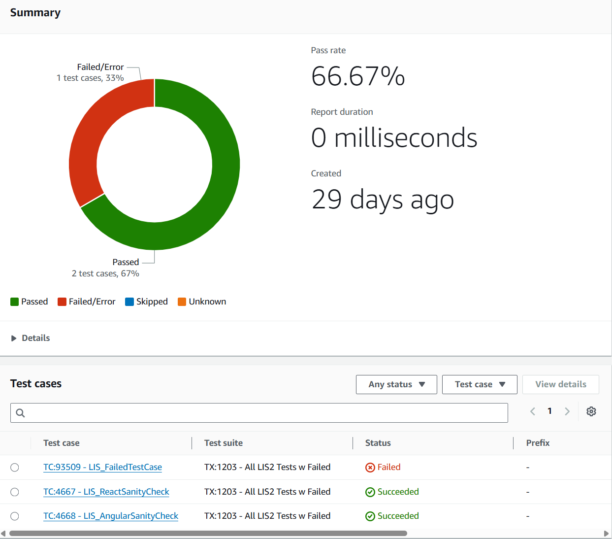

# How to Integrate Rapise into a DevOps Pipeline

## SpiraTest (recommended)

For test management and execution, we recommend using [SpiraTest](https://www.inflectra.com/SpiraTest/). Check out the [integration guide](../Guide/spiratest_integration.md) and [demonstration video](https://youtu.be/5ybrBQOzez8).

## Microsoft Tools

If you use Azure DevOps or TFS, we also have a solution:

- Azure DevOps integration v3 [manual](../Guide/vstest.md) and [video](https://youtu.be/BIgOIxkZ5Hk?t=507)
- [RapiseLauncher Extension](../Guide/vstest_rl.md) for Azure DevOps

## Jenkins (and all others)

Rapise has a command-line interface and produces test reports in XML and text formats. This enables integration with other tools. Refer to the [Jenkins integration](https://www.inflectra.com/Support/KnowledgeBase/KB300.aspx) guide as an example.

## Linux / MacOS / Docker

Rapise 8.5 introduces support for an NPM package that contains both the Rapise execution engine and RapiseLauncher. The package is distributed as a .tgz file that can be installed from a URL or a local file. For the following examples, we'll refer to this package file as `rapise.tgz`.

### Installation

=== "From URL"
    ```
    npm install <url to rapise.tgz>
    ```
=== "From File"
    ```
    npm install <path to rapise.tgz>
    ```

### How it Works

#### Running a Rapise Test

To run a single Rapise test, execute the following command:

```
npx rapise <path to .sstest>
```

#### Configuring the Spira Connection

RapiseLauncher offers three flexible ways to configure your connection to Spira. Choose the method that best suits your workflow, from initial setup to fully automated CI/CD pipelines.

##### Manual Configuration

This method is ideal for users who already have Rapise configured on a Windows machine and want to reuse those settings.

1.  **Obtain the File:** Locate the `RepositoryConnection.xml` file on the Windows machine where your Spira connection is already configured in the Rapise application.
2.  **Place the File:** Copy this file into the root directory of your project where you will run `npx rapiselauncher`.
3.  **Run:** RapiseLauncher will automatically detect and use this file for its connection settings.

You can manually edit this XML file to change properties like `SpiraServer` or `SpiraUser`.

> **Important:** The `SpiraPassword` value in the file is an encrypted API Key. You **cannot** edit this value directly in a text editor. If you need to change your credentials, you must either use the `--set` option or allow the interactive setup to regenerate the file.

##### Interactive Setup

If you are setting up RapiseLauncher for the first time on a new machine without an existing configuration file, you can use the interactive mode.

Simply run `rapiselauncher` without a `RepositoryConnection.xml` file and without using the `--set` flag. The process is as follows:

1.  RapiseLauncher detects that no configuration is available.
2.  It prompts you to enter the `SpiraServer` URL, `SpiraUser`, and `SpiraPassword` (this should be your plain-text API Key).
3.  It then tests the connection using the details you provided.
4.  If the connection is successful, it saves these details into a new `RepositoryConnection.xml` file in the default directory and proceeds to execute your command.

This interactive mode is very useful for local development but is **not suitable for automated environments** like CI/CD, as it requires manual input.

##### Dynamic Configuration

The `--set` option allows you to provide Spira connection parameters directly on the command line. This is the preferred method for CI/CD environments as it is non-interactive and keeps credentials out of source control.

The `--set` flag's sole purpose is to **create or update the configuration file on disk**.

**Key Behavior:**
When you use `--set`, RapiseLauncher will apply the specified settings to `RepositoryConnection.xml` and then **immediately exit**. It will not execute any tests in the same command.

This creates a clear two-step workflow for automation:

1.  **Configure:** Run `rapiselauncher` with `--set` parameters to ensure the environment is correctly configured.
2.  **Execute:** Run `rapiselauncher` again, this time with your test parameters (`-p`, `-t`, etc.), to execute the tests using the newly saved configuration.

**How it Works:**

*   If `RepositoryConnection.xml` **exists**, the parameters provided via `--set` will update the corresponding values within that file.
*   If `RepositoryConnection.pod` **does not exist**, a new file will be created with the settings you provide.

**CI/CD Example:**

```bash
# Step 1: Set up the configuration. This command creates/updates the XML file and exits.
npx rapiselauncher \
  --set SpiraServer=$SPIRA_URL \
  --set SpiraUser=$SPIRA_USERNAME \
  --set SpiraPassword=$SPIRA_API_KEY

# Step 2: Now that configuration is saved, execute the tests.
npx rapiselauncher -t 101 --report test-results.xml
```

#### Running RapiseLauncher

If `RepositoryConnection.xml` is in the same directory as your project or located in `~/.rapise`, you can launch RapiseLauncher with a simple command:

```
npx rapiselauncher
```

If the configuration file is in a different location, use the `--config` flag to specify its path:

```
npx rapiselauncher --config <path to RepositoryConnection.xml>
```

Running RapiseLauncher without any test set IDs starts it in polling mode. In this mode, it continuously checks the connected SpiraTest instance for new jobs to execute.

To run specific test sets and then exit, pass their IDs on the command line:

```
npx rapiselauncher -t 100,101,102
```

##### Command Line

```
Usage: npx rapiselauncher [options]

Options:
  -c, --config   Path to RepositoryConnection.xml
      --param    Set a global variable (e.g., --param g_enableVideoRecording=true)
  -p, --project  Project ID
  -t, --testset  Test Set ID (comma-separated list)
      --windows  Run in Windows mode
      --details  Print results on exit
      --report   Path to file for JUnit XML results output
      --set      Set a Spira configuration parameter (e.g., --set SpiraServer=https://yourcompany.spiraservice.net/
                 --set SpiraUser=FreddBloggs --set SpiraPassword=ApiKey)
  -h, --help     Show help
```

##### Viewing and Reporting Test Results

There are two primary ways to view the outcome of a test run:

-   **Displaying a Summary (`--details`)**
    The `--details` flag prints a summary of the test run results directly to the console upon completion. This is useful for a quick, immediate overview of the outcome.

-   **Generating a JUnit XML Report (`--report`)**
    For integration with CI/CD systems, use the `--report` option to generate a detailed test report in the **JUnit XML format**. This is a standard format widely supported by tools like Jenkins, GitLab CI, Azure DevOps, and AWS CodeBuild, allowing them to parse, display, and act upon the test results.

**Example Usage:**

```bash
npx rapiselauncher -t 101,102 --report test-results.xml
```

This command runs test sets 101 and 102 and saves the results to a file named `test-results.xml`.

Once generated, this XML file can be consumed by your CI/CD platform. For example, AWS CodeBuild can visualize the report like this:

{width=640}

### CI/CD Integration

Below are sample .yml files for running Rapise tests with AWS CodeBuild, Azure DevOps, GitHub Actions, and Docker.

Web tests are typically run in headless mode. If GUI emulation is required (i.e., for non-headless execution), you will need to install a virtual framebuffer like [Xvfb](https://x.org/releases/X11R7.7/doc/man/man1/Xvfb.1.xhtml) on the execution machine.

#### AWS CodeBuild

=== "buildspec.yml"
    ```
    version: 0.2

    phases:
      install:
        runtime-versions:
          nodejs: 22
        commands:
          - echo "Installing Rapise..."
          - npm install rapise.tgz

      build:
        commands:
          - echo "Starting UI tests in headless mode..."
          - npx rapiselauncher -c RepositoryConnection.xml -t 925 --details --param "g_browserLibrary=Selenium - ChromeHeadless"
    ```

#### Azure DevOps

=== "headless-pipeline.yml"
    ```
    trigger: none

    pool:
      vmImage: ubuntu-latest

    steps:
    - script: lsb_release -a
      displayName: 'Print OS Version'

    - task: NodeTool@0
      inputs:
        versionSpec: '22.x'
      displayName: 'Install Node.js 22'

    - script: |
        echo "Installing Rapise..."
        npm install rapise.tgz
      displayName: 'Install Rapise'
      workingDirectory: $(Build.SourcesDirectory) # Ensure working directory is the root of the repo

    - script: |
        echo "Launching Rapise..."
        npx rapiselauncher -c RepositoryConnection.xml -t 925 --details --param "g_browserLibrary=Selenium - ChromeHeadless"
      displayName: 'Run Rapise Launcher'
      workingDirectory: $(Build.SourcesDirectory) # Ensure working directory is the root of the repo    
    ```
=== "xvfb-pipeline.yml"
    ```
    trigger: none

    pool:
      vmImage: ubuntu-latest

    steps:
    - script: lsb_release -a
      displayName: 'Print OS Version'

    - task: NodeTool@0
      inputs:
        versionSpec: '22.x'
      displayName: 'Install Node.js 22'
    
    - script: |
        sudo apt-get update
        sudo apt-get install -y xvfb
      displayName: 'Install Xvfb'

    - script: |
        echo "Installing Rapise..."
        npm install rapise.tgz
      displayName: 'Install Rapise'
      workingDirectory: $(Build.SourcesDirectory) # Ensure working directory is the root of the repo

    - script: |
        # This entire block is executed within the virtual display environment
        xvfb-run --auto-servernum --server-args="-screen 0 1280x1024x24" bash <<'EOF'
        
        echo "--- Launching Rapise inside the Xvfb virtual environment ---"
        
        # Your command runs here, with access to the virtual GUI
        npx rapiselauncher -c RepositoryConnection.xml -t 925 --details
        
        echo "--- Rapise execution complete ---"
        
        EOF
      displayName: 'Run Rapise Launcher with Xvfb'
      workingDirectory: $(Build.SourcesDirectory)
    ```
#### GitHub Actions

=== "headless-pipeline.yml"
    ```
    name: Run Rapise Tests

    # This makes the workflow manually triggerable from the Actions tab.
    # It's the direct equivalent of Azure DevOps' "trigger: none".
    on:
      workflow_dispatch:

    jobs:
      run-rapise:
        # This is the equivalent of "pool: vmImage: ubuntu-latest"
        runs-on: ubuntu-latest

        steps:
        # Step 1: Check out the repository code
        # This is done automatically in Azure DevOps, but it is a required explicit step in GitHub Actions.
        - name: Check out repository
          uses: actions/checkout@v4

        # Step 2: Install Node.js
        # This is the equivalent of the "NodeTool@0" task.
        - name: Install Node.js 22
          uses: actions/setup-node@v4
          with:
            node-version: '22.x'

        # Step 3: Install Rapise
        # The 'run' keyword is the equivalent of 'script'.
        - name: Install Rapise
          run: |
            echo "Installing Rapise..."
            npm install rapise.tgz

        # Step 4: Run the Rapise Launcher
        - name: Run Rapise Launcher
          run: |
            echo "Launching Rapise..."
            npx rapiselauncher -c RepositoryConnection.xml -t 925 --details --param "g_browserLibrary=Selenium - ChromeHeadless"
    ```
=== "xvfb-pipeline.yml"
    ```
    name: Run Rapise Tests xvfb

    # This makes the workflow manually triggerable from the Actions tab.
    # It's the direct equivalent of Azure DevOps' "trigger: none".
    on:
      workflow_dispatch:

    jobs:
      run-rapise:
        # This is the equivalent of "pool: vmImage: ubuntu-latest"
        runs-on: ubuntu-latest

        steps:
        # Step 1: Check out the repository code
        # This is done automatically in Azure DevOps, but it is a required explicit step in GitHub Actions.
        - name: Check out repository
          uses: actions/checkout@v4

        # Step 2: Install Node.js
        # This is the equivalent of the "NodeTool@0" task.
        - name: Install Node.js 22
          uses: actions/setup-node@v4
          with:
            node-version: '22.x'
            
        # Step 3: Install Xvfb
        - name: Install Xvfb
          run: sudo apt-get update && sudo apt-get install -y xvfb

        # Step 4: Install Rapise
        # The 'run' keyword is the equivalent of 'script'.
        - name: Install Rapise
          run: |
            echo "Installing Rapise..."
            npm install rapise.tgz

        # Step 5: Run the Rapise Launcher
        - name: Run Rapise Launcher with Xvfb
          run: |
            # This entire block is executed within the virtual display environment
            xvfb-run --auto-servernum --server-args="-screen 0 1280x1024x24" bash <<'EOF'
            
                echo "--- Launching Rapise inside the Xvfb virtual environment ---"
            
                # Your command runs here, with access to the virtual GUI
                npx rapiselauncher -c RepositoryConnection.xml -t 925 --details
            
                echo "--- Rapise execution complete ---"
            
            EOF
          working-directory: ${{ github.workspace }}
    ```   

#### Docker

=== "docker-compose.yml"
    ```
    services:
      rapise-tester:
        build: .
        volumes:
          # This single line maps your current project directory on the host ('.')
          # to the /app directory inside the container.
          - ./:/app
          # THIS IS THE FIX: This tells Docker to create an anonymous volume
          # at /app/node_modules, effectively preserving the one from the image
          # and preventing the host from overwriting it.
          - /app/node_modules

    # Add this entire "networks" section at the bottom
    networks:
      default:
        driver: bridge
        driver_opts:
          com.docker.network.driver.mtu: "1400" # Good starting point for most VPNs
    ```
=== "Dockerfile"
    ```
    # Use a modern, slim Debian base image
    FROM debian:bookworm-slim

    # Set an environment variable to prevent interactive prompts during installation
    ENV DEBIAN_FRONTEND=noninteractive

    # ==== 1. Install System Dependencies and Chrome (Using curl) ====
    RUN apt-get update && apt-get install -y \
        curl \
        ca-certificates \
        git \
        iputils-ping \
        iproute2 \
        openssl \
        --no-install-recommends && \
        # Download the official .deb package from Google using curl
        # -L: Follow redirects (important for download links)
        # -o: Specify output file
        curl -L -o /tmp/google-chrome-stable_current_amd64.deb \
        "https://dl.google.com/linux/direct/google-chrome-stable_current_amd64.deb" && \
        # Use apt to install the local .deb file.
        # apt is smart and will automatically fetch all necessary dependencies.
        apt-get install -y /tmp/google-chrome-stable_current_amd64.deb && \
        # Clean up the downloaded file
        rm /tmp/google-chrome-stable_current_amd64.deb

    # ==== 2. Install Node.js 22 ====
    # The Node.js installation script already uses curl, so this is consistent.
    RUN curl -fsSL https://deb.nodesource.com/setup_22.x | bash - && \
        apt-get install -y nodejs

    # ==== 3. Set up the application environment and install the Rapise package ====
    WORKDIR /app

    # Copy ONLY the rapise.tgz package first.
    COPY rapise.tgz ./

    # Run npm install based *only* on the file above.
    RUN npm install ./rapise.tgz

    # ==== 4. Copy the rest of your source code ====
    COPY . .

    # ==== 5. Clean up ====
    # Since we need curl for Node.js setup, we don't remove it until the end.
    RUN apt-get purge -y --auto-remove && \
        rm -rf /var/lib/apt/lists/*
    ```
=== "rapise.tgz"
    ```
    Should be located in the same directory as the Dockerfile.
    ```
=== "RepositoryConnection.xml"
    ```
    Should be located in the same directory as the Dockerfile.
    ```