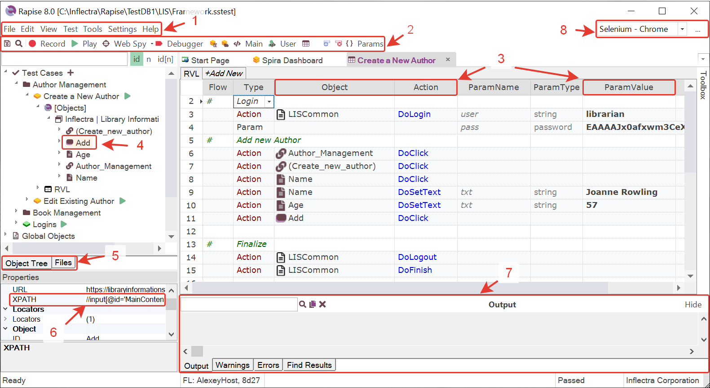
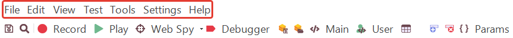
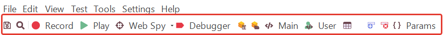
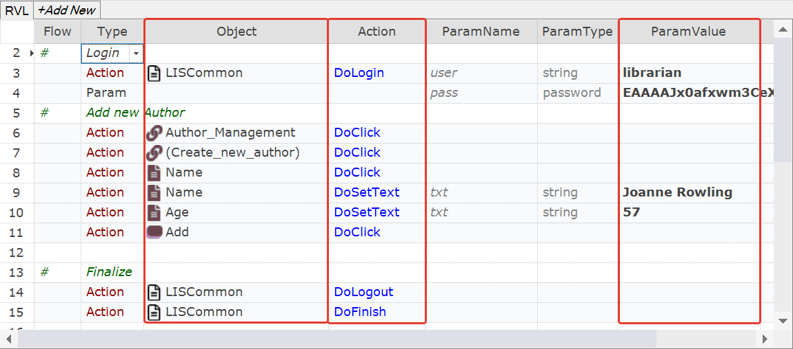
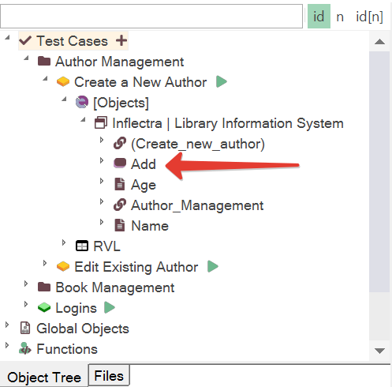
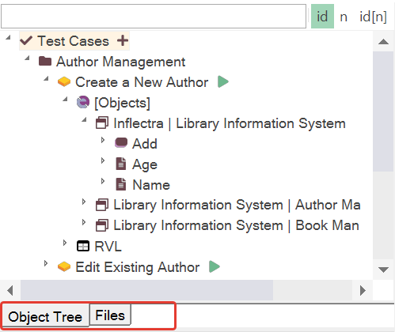
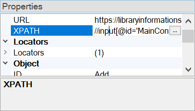
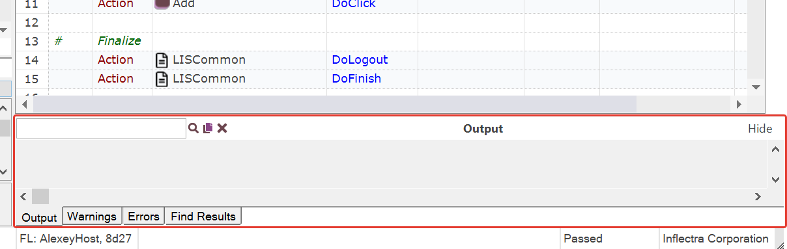
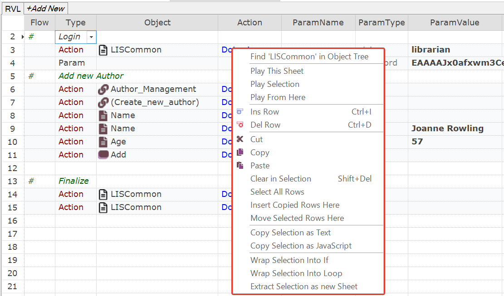
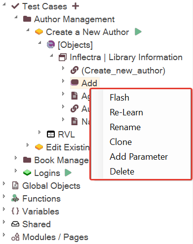

# Know Your Way Around

## Basic Navigation

{: width="1024" }

??? abstract "1 - Main Menu"
    Use the [main menu](../Guide/menu_and_toolbars.md) to create new tests, change [test settings](../Guide/settings_dialog.md), and [global options](../Guide/options_dialog.md).
    

??? abstract "2 - Main Toolbar"
    Use the [main toolbar](../Guide/menu_and_toolbars.md#main-toolbar) to start [recording](../Guide/object_types.md) and [playback](../Guide/playback.md), and to quickly switch between test components.
    

    - **Main** opens the main entry point of a test (`Main.rvl.xlsx` or `Main.js`).
    - **User** opens `User.js`, the file for custom JavaScript functions.
    - **RVL** opens the [RVL](../Guide/visual_language.md) spreadsheet.

??? abstract "3 - RVL Columns"
    The most used [RVL columns](../RVL/Columns.md) are `Object`, `Action`, and `ParamValue`. Use them to create and modify new test steps.
    

??? abstract "4 - Object in the Object Tree"
    The [Object Tree](../Guide/object_tree.md) contains [objects](../Libraries/libraries.md) captured during [recording](../Guide/object_types.md). These objects are embedded into other assets that make up the [Testing Framework](../Guide/Frameworks/frameworks.md).
    {: width="300" }

??? abstract "5 - Object Tree and Files View"
    The [Object Tree](../Guide/object_tree.md) displays the [testing framework's](../Guide/Frameworks/frameworks.md) objects. Switch to the [Files View](../Guide/test_files_dialog.md) to navigate the framework's files.
    {: width="300" }

??? abstract "6 - Object Properties"
    [This pane](../Guide/properties.md) displays the properties of a selected object.
    {: width="300" }

??? abstract "7 - Output View"
    The [Output view](../Guide/output_view.md) is a collection of tabs that displays the test execution log, JavaScript warnings and errors, and search results.
    

??? abstract "8 - Profile Dropdown"
    The dropdown allows you to switch the [Browser](../Guide/browser_settings.md), [Selenium](../Guide/selenium_settings_dialog.md), or [Mobile](../Guide/mobile_settings_dialog.md) profile.
    

## RVL Popup Menu

The pop-up menu is most frequently used to:

??? tip "Work with an object"
    - Find an object in the [Object Tree](../Guide/object_tree.md).
    - [Flash](../Manuals/kb.md#kb375-how-to-check-that-rapise-can-find-an-object-on-screen) the object: find and highlight it in the application.
    - Show the locator property of the object (e.g., XPath for web tests).
    - Rename the object and automatically update all its references in RVL.

??? tip "Play specific steps of a test"
    - **Play This Sheet**: execute actions from the active sheet.
    - **Play Selection**: execute only the selected range of actions. This is useful for tweaking tricky actions and checking the result immediately.
    - **Play from Here**: start execution at the selected line and proceed to the end. This is useful for continuing a script from the point where it stopped.

??? tip "Edit Rows"
    - Insert or delete a row.
    - Copy and paste rows.

See the full list of menu items [here](../Guide/rvl_editor.md#context-menu).

## Object Popup Menu

The pop-up menu is most frequently used to [Flash](../Manuals/kb.md#kb375-how-to-check-that-rapise-can-find-an-object-on-screen) and [Re-Learn](../Manuals/kb.md#kb428-how-to-relearn-an-object) an object.

{: width="300"}

See the full list of menu items [here](../Guide/object_tree.md#context-menu-object).

## See Also

- [Main Menu and Toolbars](../Guide/menu_and_toolbars.md)