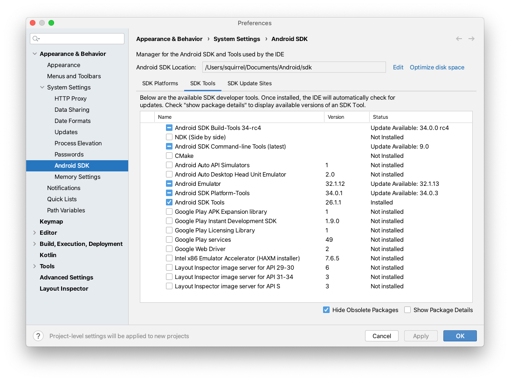
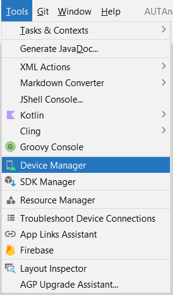

# Preparing Environment for Android Mobile Testing with Rapise

Rapise lets you record and play automated tests against native applications on a variety of mobile devices using the Android operating system. Rapise gives you the flexibility to test your applications on either real or simulated devices.

This section explains **how to setup your environment for mobile testing**, once that is done, you can the go to the section that explains the process for using Rapise to actually perform mobile testing.

Rapise uses a third-party open-source tool called [Appium](http://appium.io) that is used to actually host the mobile devices and Rapise essentially communicates to the device via Appium.

## Testing Architectures

Rapise runs on Windows computers (PC) and Android devices (both real and simulated) can be tested on either an Apple Macintosh (Mac) computer or a PC. So this means that there are two separate possible testing environments that you may need to setup:

- **Using a Mac to Host Android Emulator and Devices.** It will be necessary to install **Appium** and **Android Studio** onto the Mac and connect to Appium over the network from Rapise running on your PC.

- **Using a PC to Host Android Emulator and Devices.** You can either install **Appium** and **Android Studio** onto a separate PC or you can simply use the same PC that is running Rapise. The only difference will be whether the URL used to connect to Appium is a localhost URL or one pointing to the other PC.

The steps for setting each of these will be described separately.

For physical Android devices the architecture looks like:


For simulated Android devices (using the Android Virtual Device Manager) the architecture looks like:


## Using a Mac to Host Android Emulator and Devices

The first thing you need to do is install the latest version of Appium. The easiest way to install it is to use Terminal.

```bash
> brew install node
> npm install -g appium
```

More [about Appium installation](http://appium.io/docs/en/about-appium/getting-started/index.html#installing-appium).

Once that is installed, you will then need to download and install the latest version of Java SE Development Kit (JDK) from the [Oracle website](http://www.oracle.com/technetwork/java/javase/downloads/index.html). Once that has been installed, make sure that the **JAVA\_HOME** environment variable has been set.

Once that is installed, you will then need to install the Android Studio (you may already have it installed if you are doing Android development). You can download it from [Android Developer site](https://developer.android.com/studio/).

More [about Android Studio installation](https://developer.android.com/studio/install#mac).

Once it has installed, you will use the **Android SDK Manager** to download and install the necessary packages:


### Preparing Android Emulator

If you want to test using the Android Emulator, make sure you have installed it using the SDK manager.



Then you can launch (from the main menu of the Android Studio) the **Android Virtual Device (AVD) Manager**.




In this case you can just create the Android Virtual Device, Start it and then connect to it using Rapise.

### Preparing a Physical Android Device

If you are going to be testing a physical Android device, you will need to do the following.

The Settings app on Android includes a screen called **Developer options** that lets you configure system behaviors that help you profile and debug your app performance.

**Enable developer options and debugging**

On Android 4.1 and lower, the **Developer options** screen is available by default. On Android 4.2 and higher, you must enable this screen as follows:

1. Open the Settings app.
2. (Only on Android 8.0 or higher) Select System.
3. Scroll to the bottom and select About phone.
4. Scroll to the bottom and tap Build number 7 times.
5. Return to the previous screen to find Developer options near the bottom.

At the top of the Developer options screen, you can toggle the options on and off.


You probably want to keep this on. When off, most options are disabled except those that don't require communication between the device and your development computer.

Next, you should scroll down a little and enable **USB debugging**. This allows Android Studio and other SDK tools to recognize your device when connected via USB, so you can use the debugger and other tools.

Read more [about Developer Options and USB Debugging](https://developer.android.com/studio/debug/dev-options).

You are now ready to start mobile testing of your Android Device and Android Emulator.

## Using a PC to Host Android Emulator and Devices

The first thing you need to do is install the latest version of Appium.
The easiest way to install it is to use Command Prompt.

1. Install NodeJS and NPM as [described here](http://nodejs.org/).
2. Install Appium

```bash
> npm install -g appium
```

Once that is installed, you will then need to download and install the latest version of Java SE Development Kit (JDK) from the [Oracle website](http://www.oracle.com/technetwork/java/javase/downloads/index.html). Once that has been installed, make sure that the  **JAVA\_HOME** environment variable has been set.

Once that is installed, you will then need to install the Android Studio (you may already have it installed if you are doing Android
development). You can download it from [Android Developer site](https://developer.android.com/studio/).

More [about Android Studio installation](https://developer.android.com/studio/install#windows)

Once it has installed, you will use the **Android SDK Manager** to download and install the necessary packages.


### Preparing Android Emulator

If you want to test using the Android Emulator, make sure you have installed it using the SDK manager.


Then you can launch (from the main menu of the Android Studio) the **Android Virtual Device (AVD) Manager**.


In this case you can just create the Android Virtual Device, Start it and then connect to it using Rapise.

### Preparing a Physical Android Device

See topic with same name in **Using a Mac to Host Android Emulator and Devices** chapter.
