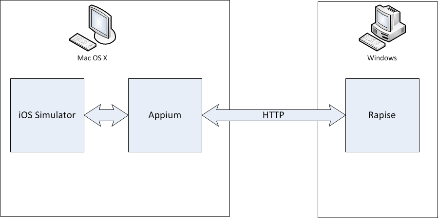
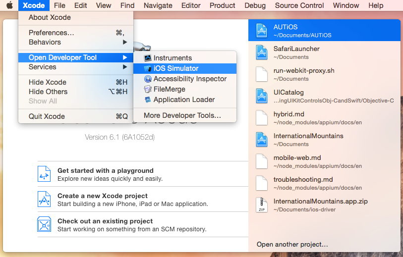
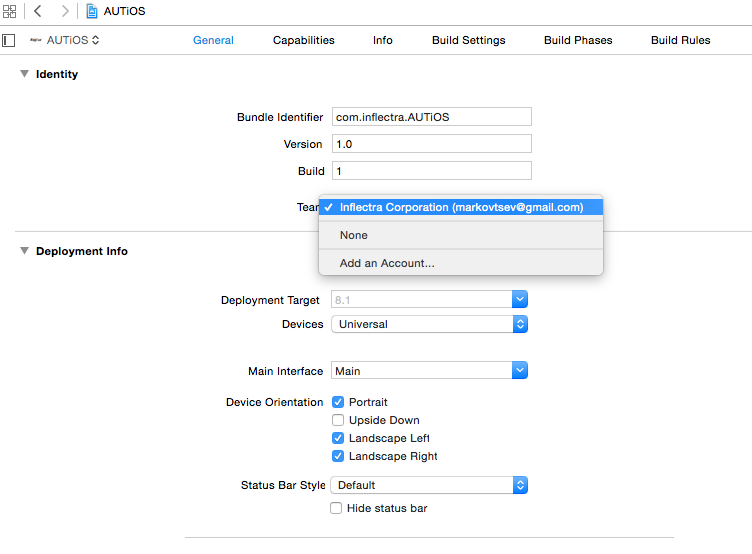
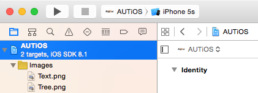
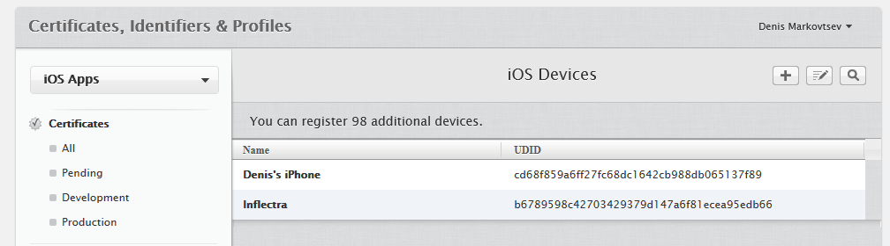
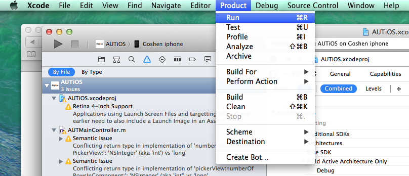

# Preparing Environment for iOS Mobile Testing with Rapise

Rapise lets you record and play automated tests against native applications on a variety of mobile devices using Apple iOS. Rapise
gives you the flexibility to test your applications on either real or simulated devices.

This section explains **how to setup your environment for mobile testing**, once that is done, you can the go to the section that
explains the process for using Rapise to actually perform mobile testing.

Rapise uses a third-party open-source tool called [Appium](http://appium.io>) that is used to actually host the mobile devices and Rapise essentially communicates to the device via Appium.

## Testing Architecture

Since Rapise runs on Windows computers (PC) and iOS devices (both real and simulated) can only be tested on an Apple Macintosh (Mac) computer, it is necessary that you install **Appium** and **Apple Xcode** onto the Mac and connect to Appium over the network from Rapise running on your PC.

For Physical iOS devices the architecture looks like:


For simulated iOS devices (using the XCode iOS Simulator) the architecture looks like:



## Using a Mac to Host iOS Simulator and Devices

The first thing you need to do is install Xcode from the Apple Mac app store. Make sure you include the **iOS SDK**, and also the **iOS
Simulator** if you intend to test simulated iOS devices.



*(Please refer to the [Apple tutorial](https://developer.apple.com/library/ios/referencelibrary/GettingStarted/RoadMapiOS/) if you are writing your first iOS application and need an introduction into how to develop for iOS).*

## Get the AUTiOS Source Code

Sample iOS application is hosted in [AUTiOS Repository](https://github.com/Inflectra/AUTiOS).

Launch Xcode on the Mac and check out the application from the repository:


Before you can actually build and deploy this project, you will need to register for an **Apple ID** and setup an Apple Developer account. You should check with your company to see if they have already joined the **Apple iOS Developer Program**, if not, you will need to join yourself and become a member. You can learn more about this at the [Apple developer website](https://developer.apple.com).

## Join Your iOS Development Team

Assuming that either you or your company already has signed up for the iOS Developer Program, you will need to ask the administrator of your account (it might be you) to send an invitation to you if you are not already a member. The link for accepting such an invitation is
typically:

<https://developer.apple.com/programs/start/jointeam/index.php?success=%2Fios%2Finvitation%2Faccept.action>

Click on this link and accept the invitation.

Meanwhile, back in Xcode Use the **‘Add an Account…’** to login with your **Apple ID**:



## Building and Deploying on a Simulated Device

Now that you have signed into Xcode using your developer account, you can select a simulated device and run the project on it:


Once you have selected the simulated iOS device you want to use, click the **Product &gt; Build** option to build the app for the targeted
device. You can use the **Run** option to make sure that the app actually launches on this device before testing it with Rapise.



Assuming that this is successful, you will see the AUTiOS running in the iOS Simulator:

{width="255px"}

If you are only going to use Simulated devices (not recommended) then you can skip the next section and just continue with setting up
**Appium**, as described in the main Mobile Testing topic.

## Building and Deploying on a Physical Device

Login with your **Apple ID** to <http://developer.apple.com>

Choose Certificates, Identifiers & Profiles:


Select Devices:

{width="278px"}

Add your device's UDID to the list of registered iOS devices in the developer account:



You can find out the UDID by connecting it to the Mac and viewing the device inside Xcode.


Then, back in Xcode choose your physical device, and use the **Product &gt; Build and Run** option to test that the app launches on the device:



## Installing Appium on the Mac

The first thing you need to do is install the latest version of Appium. The easiest way to install it is to use Terminal.

```bash
> brew install node
> npm install -g appium
```

More [about Appium installation](http://appium.io/docs/en/about-appium/getting-started/index.html#installing-appium).

*You are now ready to start mobile testing of your iOS simulator or device.*
