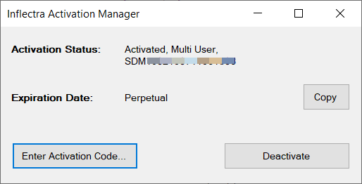

# Rapise Installation Guide

## Introduction

Rapise® is a next generation software test automation tool that leverages the power of open architecture to improve application quality and reduce time to market.

This installation guide outlines how to setup a working installation of Rapise including the installation of any dependencies and prerequisites. It also provides information on obtaining an evaluation or production license key from Inflectra so that you can use the software.

It assumes a basic understanding of how to setup and administer a Windows® workstation, and also assumes that you have access to a valid Administrator level account that can install software.

For information on how to use the features of Rapise please refer to either the [Rapise Quick Start Guide](/Guide/tutorial_record_and_playback/) or the [Rapise User's Guide](/Guide/overview/) instead.

## 1. Installing Rapise

This section outlines how to prepare your system for installation of Rapise, and how to actually install the software using the provided
installation package.

The first sub-section will outline what hardware and software configurations are supported and the exact installation sequence for different versions of Microsoft® Windows®. The second sub-section will explain how to load the Rapise software onto the computer, and discuss common problems and solutions.

The minimum hardware and software requirements for running the Rapise are:

| **Requirement**       | **Minimum Specification**                      |
| --------------------- | ---------------------------------------------- |
| **Processor:**        | Intel® or AMD® x86 or x64 compatible processor |
| **Memory:**           | 2 GB, 4 GB recommended                         |
| **Disk Space:**       | 5 GB                                           |
| **Display:**          | XGA (1024 x 768)                               |
| **Operating System:** | Microsoft Windows 7 (x86 and x64)              |
|                       | Microsoft Windows 8 (x86 and x64)              |
|                       | Microsoft Windows 8.1 (x86 and x64)            |
|                       | Microsoft Windows 10                           |
|                       | Microsoft Windows Server 2008 R1 / R2          |
|                       | Microsoft Windows Server 2012 R1 / R2          |
|                       | Microsoft Windows Server 2016                  |
| **Web Browsers:**     | Internet Explorer 8.0+                         |
|                       | Mozilla Firefox                                |
|                       | Google Chrome                                  |
|                       | Apple Safari                                   |
|                       | Opera                                          |
| **Other Components:** | .NET Framework 4.0                             |
|                       | .NET Framework 3.5 SP1                         |

## 1.1. System Prerequisites

Assuming that you have already installed the appropriate version of Microsoft Windows onto your computer (or that has been pre-installed for you), you need to then make sure that the various prerequisites have been correctly added to your installation before trying to install Rapise. The Rapise installer will check to ensure that the various prerequisites are in place, and will install any missing perquisites (apart from the Microsoft .NET 4.0 Framework) automatically.

### 1.1.1. Microsoft .NET 3.5 SP1 and 4.0

On Windows 10, 8, and Windows 2012 Server installations, Microsoft .NET Framework v4.5 is usually installed as part of the factory configuration, whereas on earlier operating systems, you might need to manually add the .NET 4.0 components to the factory configuration.

To see which version of the Microsoft .NET framework installed, open up Windows Explorer® and navigate to

    C:\WINDOWS\Microsoft.NET\Framework
    
and then the subfolders listed will indicate which version(s) of the framework you have installed:

To install the .NET Framework, launch Internet Explorer and enter the URL: <http://www.microsoft.com/netframework>. From this page there will be links to download and install the appropriate version of the .NET Framework (4.0). Click on the option to download and install the .NET Framework, and follow the instructions provided. Once you have complete the install, verify that the installation was successful by looking in the

    C:\WINDOWS\Microsoft.NET\Framework

folder as illustrated above.

> **Note:** For your convenience, the Inflectra Customer Area also includes a copy of the .NET Framework 4.0 that you can download from the same place as Rapise itself.

## 1.2. Remove any Previous Versions

Before installing the current version of Rapise, we recommend first uninstalling any previous versions of Rapise to ensure you have a clean installation. To do this, go to `Start > Control Panel > Programs and Features`:

The click the "Rapise" entry and confirm that you want to install the existing installed version.

## 1.3. Installing the Software

Now that all the prerequisites have been correctly installed, you are now ready to install Rapise onto your system. To perform the
installation, you will need the installation package downloaded from the Inflectra® website.

To start the installation, double-click on the Rapise installation package (it will have a filename of the form Rapise-vX.X.X.X.exe), and the Windows Installer will display the following dialog box:

The first screen in the installation wizard outlines the Inflectra End User License Agreement (EULA). Please read this carefully as it describes the legal contract between you -- the user of the software -- and Inflectra® Corporation, the developer and publisher. Once you have read the agreement and understood your rights and obligations, select the checkbox marked "I agree to the license terms and conditions" and click the `Install` button.

This will begin the process of installing Rapise onto your system. If you are installing Rapise onto Windows Vista or newer, then you may be prompted by the Windows User Access Control (UAC) security system to confirm that you want to install a new piece of software:

Click the option that confirms you want to proceed with the install.

The installer will then display a progress bar that gradually fills as the installation proceeds. Once the installation is complete, the
following message will be displayed:

Congratulations! You have successfully installed Rapise onto your system.

You should now have a Rapise shortcut icon added to your Windows Desktop and if you click on **Start > Program Files > Inflectra > Rapise**, you should see the new Rapise program group:

## 2. Activating Rapise

Once you have successfully installed Rapise, you will need to activate it with a license key (either a temporary evaluation key or a permanent production key). This section describes the process for activating your copy of Rapise as well as how to perform updates to the license key and potentially move it to another computer.

## 2.1. Getting Your Activation Code

When you first launch Rapise after installation, it will display the following dialog box:

You should now enter the alphanumeric activation code from the Customer Area of the Inflectra website (the same page that you downloaded the installation package from). It will be displayed in the "My Licenses" section of the webpage. An example page is shown below:

There are two kinds of activation code:

- Evaluation Activation Codes -- these start with the letters "DMO"
- Production Activation Codes -- these start with the letters "SDM"

You should enter the appropriate activation code into the Rapise activation wizard and choose the option to either activate online or
offline. If you are connected to the Internet, online activation is easier. If you are not connected to the Internet (e.g. working in a
secure environment), then you will need to use the offline activation option.

The following sections will explain how each of the options work:

## 2.2. Activating Online

To use online activation, make sure you are connected to the Internet, enter the activation code, choose "Activate Online" and click the
`Next` button:

The activation system will contact our activation server, process the activation code and activate the license. The application will start automatically and if you visit the Customer Area of our website, you will see that it is listed as activated, with a license key displayed:

## 2.3. Activating Offline

To use offline activation, enter the activation code, choose "Activate
Offline" and click the \<Next\> button:

This will bring up the Offline Activation screen:

Click on the `Save` button to save the Rapise.LIC file to your hard drive.

Copy across the Rapise.LIC file to a computer that has Internet access and open up the Customer Area of our website:

Click on the **Activate** link which will take you to the Offline Activation part of our website:

Click on the `Browse` button and navigate to the place where the Rapise.LIC file is stored. Then click on the \[Activate\] button to
begin the activation process. Assuming that the License file is valid, the website will activate the license and take you back to the Customer Area where the license key will be displayed:

Click on the License Key hyperlink and you will be prompted to save the Rapise.CDM file to your hard drive. Save this file and then copy it across to the computer that has Rapise installed. Now on the Offline Activation screen:

Click the Step 3 `Open` button and browse to the Rapise.CDM file. Once you have the file selected, click on the `Finish` button to complete the activation. Assuming that the Rapise.CDM file is valid, the application will start.

> **Note:** If you have any problems activating your installation, please go to <https://www.inflectra.com/Support> and contact Inflectra customer support and they will help you resolve your problem.

## 2.4. Upgrading from Demo License

If you have installed a demonstration license, when the expiration date is reached the software will stop working and prompt to you purchase a commercial license. To purchase the commercial license, go to <http://www.inflectra.com/Rapise> and click on the appropriate Purchase link to obtain a commercial production license.

Once you have purchased the license your Customer Area will display a new activation code. Simply start up Rapise, enter the new activation code and follow the process described in section 2.2 or 2.3.

If you want to upgrade your license **before** the demonstration license is expired, you need to click on the menu **Help > Activation**:

This will bring up the Activation dialog box:

Click on the `Enter Activation Code` button and then follow the steps in 2.3 or 2.4 to activate the product with the new production license.

## 2.5. Transferring to Another Computer

Sometimes you need to transfer your Rapise license from one computer to another, or the computer it's installed on needs to be rebuilt. In either case, it's important that you first deactivate the product from the current computer, otherwise you will be prevented from activating the product on the new / rebuilt computer.

To deactivate your current installation, you need to click on the **Activation** button in the Help section of the Rapise Test ribbon:

This will bring up the Activation dialog box:

Click on the `Deactivate` button and activation system will contact our activation server, process the deactivation code and deactivate the license. If you visit the Customer Area of our website, you will see that it is listed as deactivated, with the option to activate it now available:

> **Note:** If you have any problems deactivating your installation, please go to <https://www.inflectra.com/Support> and contact Inflectra customer support and they will help you resolve your problem.

## Legal Notices

This publication is provided as is without warranty of any kind, either express or implied, including, but not limited to, the implied warranties of merchantability, fitness for a particular purpose, or non-infringement.

This publication could include technical inaccuracies or typographical errors. Changes are periodically added to the information contained herein; these changes will be incorporated in new editions of the publication. Inflectra® Corporation may make improvements and/or changes in the product(s) and/or program(s) and/or service(s) described in this publication at any time.

The sections in this guide that discuss internet web security are provided as suggestions and guidelines. Internet security is constantly evolving field, and our suggestions are no substitute for an up-to-date understanding of the vulnerabilities inherent in deploying internet or
web applications, and Inflectra^®^ cannot be held liable for any losses due to breaches of security, compromise of data or other cyber-attacks that may result from following our recommendations.

The section of the manual that describes modifying the Windows System Registry ("Registry") should only be attempted by experienced Windows administrators who are familiar with its organization and contents. Inflectra® cannot be held liable for any losses due to damage to the system registry made by inexperienced personnel.

SpiraTest®, SpiraTeam®, Rapise® and Inflectra® are either trademarks or registered trademarks of Inflectra Corporation in the United States of America and other countries. Microsoft®, Windows®, Explorer® and Microsoft Project® are registered trademarks of Microsoft Corporation.

All other trademarks and product names are property of their respective holders.

Please send comments and questions to:

    Technical Publications
    Inflectra Corporation
    8121 Georgia Ave
    Suite 504
    Silver Spring, MD 20910
    U.S.A.

[*support@inflectra.com*](mailto:support@inflectra.com)
