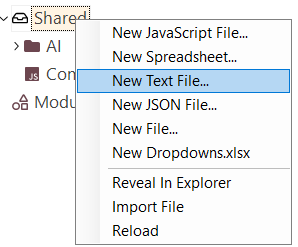

# AI

In RVL, the `AI` action is used to trigger static AI code generation. The format of the `AI` command without parameters is:

<table>
	<tr>
		<th>Flow</th><th>Type</th><th>Object</th><th>Action</th><th>ParamName</th><th>ParamType</th><th>ParamValue</th>
	</tr>
	<tr>
		<td></td>
		<td>AI</td>
		<td colspan="5">Command text explaining the command step</td>
	</tr>
</table>

Example:

=== "Screenshot"
    
=== "Transcript"
    <table>
        <tr>
            <th>Flow</th><th>Type</th><th>Object</th><th>Action</th><th>ParamName</th><th>ParamType</th><th>ParamValue</th>
        </tr>
        <tr>
            <td></td>
            <td>AI</td>
            <td colspan="5">Login to the system as librarian/librarian</td>
        </tr>
    </table>

Or with parameters:

<table>
	<tr>
		<th>Flow</th><th>Type</th><th>Object</th><th>Action</th><th>ParamName</th><th>ParamType</th><th>ParamValue</th>
	</tr>
	<tr>
		<td></td>
		<td>AI</td><td colspan="5">Command text explaining the command step and using <strong>{someParam1}</strong>, <strong>{someParam2}</strong>, {<strong>...</strong>} etc</td>
	</tr>
	<tr>
		<td></td>
		<td>Param</td>
		<td></td>
		<td></td>
		<td><strong>someParam1</strong></td>
		<td>string</td>
		<td>...</td>
	</tr>
	<tr>
		<td></td>
		<td>Param</td>
		<td></td>
		<td></td>
		<td><strong>someParam2</strong></td>
		<td>string</td>
		<td>...</td>
	</tr>
	<tr>
		<td></td>
		<td>Param</td>
		<td></td>
		<td></td>
		<td><strong>...</strong></td>
		<td>string</td>
		<td>...</td>
	</tr>
</table>

For example, if you want to pass a parameter, you must mention it in the `AI` command text in curly braces (e.g., **{param1}**) and then define a parameter with the same name but without curly braces (**param1**).

`AI` command parameters represent dynamic values that may vary during execution. This allows the generated code to remain intact while the values may be different.

Example:

=== "Screenshot"
    
=== "Transcript"
    <table>
        <tr>
            <th>Flow</th><th>Type</th><th>Object</th><th>Action</th><th>ParamName</th><th>ParamType</th><th>ParamValue</th>
        </tr>
        <tr>
            <td></td>
            <td>AI</td><td colspan="5">Login to the system as {username}/{password}</td>
        </tr>
        <tr>
            <td></td>
            <td>Param</td>
            <td></td>
            <td></td>
            <td>username</td>
            <td>string</td>
            <td>librarian</td>
        </tr>
        <tr>
            <td></td>
            <td>Param</td>
            <td></td>
            <td></td>
            <td>password</td>
            <td>string</td>
            <td>librarian</td>
        </tr>
    </table>

## Editing and Multiline Commands

An `AI` row must have a non-empty command description. An `AI` command can be multiline with limited formatting options (bold and italic).


To add a new line while editing a cell, press F2. Then, pressing Enter will add a new line.

### Implementation

Each `AI` action is transformed into a JavaScript code snippet. Given the unpredictable nature of today’s LLMs, all AI activity is expected to be performed once and reviewed by the test developer. No AI interactions are carried out during runtime to avoid intermittent and unpredictable results. The AI-generated code gets cached and is reused when you play the test.

All cached information regarding AI interactions is saved in the `%WORKDIR%\AI` subfolder.


#### Action Context

Every `AI` action is performed within a specific context, which can include several elements such as previous actions, variables, repository objects, positive and negative examples, and shared instructions.

### Previous Actions

It is often necessary to reference previous actions to ensure that the current AI-generated command is consistent with preceding steps. This helps maintain continuity and coherence in the automated sequence of steps within the test case.

For example, in the following image, the second action adds an author with the same name as the logged-in user for testing purposes:


Note that the `AI` command in row 3 uses the phrase *same name*, and the generated code uses `librarian` from the previous command. This means the command is interpreted within the context of the preceding steps.

### Variables

Variables allow dynamic data to be used in the AI-generated code. For example, **POCommon.DoCreateAuthor** has two parameters: `authorName` and `authorAge`. The default behavior of the AI is to use reasonable values when creating an author. In this case, it uses 30 for the age:


However, if a variable is available, the AI will use it when generating the code. See how it used the `authorAge` variable:


### Repository Objects

Repository objects play a critical role in contextualizing `AI` actions within the testing framework. They serve as references to UI elements, enabling the AI-generated commands to interact appropriately with these elements.

There are two ways to include repository objects in the test:

1. Use objects belonging to the test case.
2. Explicitly include objects using the [Repository](./Repository.md) command.

#### Test Case Repository

In the example below, we have a Calculator application. Its UI consists of a set of buttons and a result display. We have learned all objects using the Learn tool:

| Application Window                 | Objects                                  |
| ---------------------------------- | ---------------------------------------- |
|  |  |

Now, we want to implement a simple calculation, such as checking that 12.5 + 2.5 = 15. The AI can generate the necessary steps as follows:


Here, you can see that the AI split the input `12.5` into individual button clicks: `Click on 1`, `Click on 2`, `Click on Decimal Separator`, and `Click on 5`.

```javascript
SeS("Clear").DoClick()
SeS("1").DoClick()
SeS("2").DoClick()
SeS("Decimal_separator").DoClick()
SeS("5").DoClick()
```

In summary, it reused the test case's own repository to implement the user actions.

#### Using External Repository

The `AI` command recognizes external [Repositories](Repository.md) as well as local repositories. Anything defined using the `Repository` command will be used.


Each object from an external repository is wrapped in the `O(id)` function. This wrapper is needed to map the external repository ID, which contains a prefix, to the actual object:

```javascript
SeS(O("CalcButtons/Subtract")).DoClick();
```

### Tuning with Positive and Negative Examples

Incorporating positive and negative examples can substantially enhance the accuracy and reliability of AI-generated commands. By providing examples of both correct and incorrect outputs, you can guide the AI to generate more precise and relevant code.

For example, suppose we have an `AI` command that is supposed to validate the calculator's output. Here is the initial result of the code generation:


It is trying to use a non-existent action *DoVerifyText*, and thus the code snippet will fail when executed:


One way to proceed is to mark the code as incorrect by clicking the **thumbs down** icon:


This way, the example is registered in `AIExamples.txt`, which will be used with each subsequent call to the AI as a reference:


Subsequent attempts to generate code will use alternative approaches:


The code is still wrong, but it is closer to what is needed and can be tweaked.

You can tweak `AIExamples.txt` at any time by adding or removing positive and negative examples. You can open it from the `Shared/AI` node.


We can provide a good example to the AI by correcting the code. For example, the validation above:

```javascript
Tester.AssertEqual(SeS("Result").GetText(), "15")
```

This code needs to be tweaked because `GetText()` returns the name of the object, while the actual result of the calculation is returned by `GetValue()`. We can see this in the **Verify Object Properties** dialog:


Also, we can see that the calculator result may contain spaces; for example, the result of 3+2 will actually be `"5 "`. We need to trim the result for comparison (i.e., by using `Text.Trim`).

One more correction is needed: `Tester.Assert...` methods always expect the first parameter to be an assertion message. Putting it all together, we can manually correct the validation code to be:

```javascript
Tester.AssertEqual("Check that the result is 15", Text.Trim(SeS("Result").GetValue()), "15")
```

After executing it and making sure it is working, we can mark it as a positive example for other parts of the testing framework by clicking the **thumbs up** icon:


It then gets registered in `AIExamples.txt` as a positive example:


Once this positive example is registered, the code generation for similar cases will also improve. For example:


!!! note
    Rapise looks for the `AIExamples.txt` file in two folders: `%WORKDIR%/AI` and `%WORKDIR%/Shared`. If both files exist, information from both is used.

### AI Prompt Comments

AI prompt comments start with `##` and are passed directly to the `AI` command prompt. Such comments help clarify details that may assist the AI in interpreting commands.

For example, this testing framework has page objects `POAPI` and `POCommon`. Each has a `DoLogin` command: `POPAPI.DoLogin` and `POCommon.DoLogin`. It is up to the AI to choose which one to use when generating code. In this example, it preferred to use the API:


If we want the test case to use the UI instead, we can add an instruction for the AI. This instruction must start with `##` to let Rapise know that it is for the `AI`. We want to specify that all actions in this RVL should be done using the UI, not the API. Here is the result:


### Shared Instructions

Shared instructions streamline the AI code generation process by providing general guidelines and frameworks that apply across multiple test cases. These instructions ensure consistency and standardization in the AI-generated code.

Shared instructions are defined in the file `%WORKDIR%/Shared/AIPrompt.txt`. The contents of this file are appended to each AI request.

|                                   |                                   |
| --------------------------------- | --------------------------------- |
|  |  |

For example, when we test the Calculator, we always want to press the `Clear` or `C` button before performing any subsequent calculation.


Once this is defined, we need to regenerate the code. We can then see that each test begins with the same instruction:

```javascript
SeS(O("CalcButtons/Clear")).DoClick()
```

For example:


In this example, we can see that the AI is clever enough to insert the `clear` command only before a new calculation starts, not before checking the result:


!!! note
    Rapise looks for the `AIPrompt.txt` file in two folders: `%WORKDIR%/AI` and `%WORKDIR%/Shared`. If both files exist, information from both is used.

### Including Prompts in Prompts

At times, you may want to merge multiple external prompts into the prompts for a specific RVL sheet.

For example, consider the extra prompt shown below:


To apply this extra prompt only to certain sheets, you can explicitly include it using the following directive within the RVL sheet:

```
##	#include AI\ReportingPrompt.txt
```

Where `path` is the full path from the root of the framework, which you can get from the file properties:


Similarly, you can embed one prompt file within another. For instance:

```
#include AI/SomePrompt.txt
```

For example, we can include a `ToolsPrompt.txt` file like this:


In this scenario, `ToolsPrompt.txt` itself includes `AI\ReportingPrompt.txt`, resulting in:


As seen above, conditions from both prompts are applied when generating the code.

## Naming

With the introduction of AI, the naming of objects, actions, and methods, as well as the use of descriptive comments, becomes even more important. The better you express your application and API, the better the AI can combine them to implement the test. All of this together helps to improve both the quality of the test cases and the integrity of the testing framework.

## Token Saving

When working with AI-generated commands, it is crucial to be mindful of token consumption, as excessive use can lead to increased costs. Strategies for saving tokens include optimizing prompts, reusing parameterized commands, and minimizing unnecessary elaboration in command descriptions. This ensures that the AI-driven testing process remains efficient and cost-effective.

In Rapise, the whole approach is intended to save costs while maximizing efficiency. Rapise provides the AI with well-defined objects and page objects, and the AI uses them to generate the code. The generation is done while the test is created, and no AI access is required during runtime.

The only exception is if you updated an `AI` command and did not regenerate it—then the test will generate and save it to the cache before executing the command. However, in most cases, executing the test does not consume any tokens.

## See Also

- [AI Dashboard](../Guide/ai_dashboard.md#ai-dashboard)
- [AI Panel](../Guide/ai_dashboard.md#ai-panel)