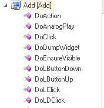
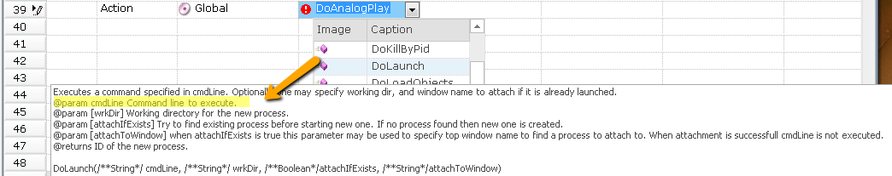
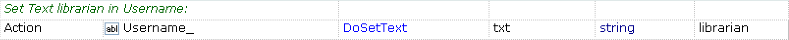

# Actions

In RVL Action always refers to an operation performed with object.

*Flow*| *Type*| *Object*   | *Action*   | *ParamName* | *ParamType*| *ParamValue*
:--  |:--     |:--         |:--         |:--          |:--         |:--
     | Action | MyButton   | DoClick    |  x          | number     | 5           
     | Param  |            |            |  y          | number     | 7           

If row type is `Action` then there must be *Object* and *Action* cells defined. 

**Note**: In this example we call an operation that would look in JavaScript as follows:
```javascript
SeS('MyButton').DoClick(5,7);
```

## Object Actions

`Object` is an ID of learned or Global object. Available objects may be found in the `Object Tree`:


*Object tree* contains list of available objects, including:

1. *Local objects* (1) learned recorded or learned from the application under test.

2. *Global object*. Always available set of objects containing most common utility functions and operations.

3. *Functions*. Represent global JavaScript functions. Each time you define a global function in .user.js file it becomes available for calling from RVL with special object ID Functions. 


Each Object has its own set of actions. You may also see them in the object tree:

 

An *Action* may have any number of parameters. See [Params](Params.md) for more info.

## Editing Action
An Action may have both mandatory and optional params. When action is selected from the dropdown its params are displayed:



By default RVL editor pre-fills only mandatory params for you when you select an action from the dropdown. In this example `DoLaunch` has one mandatory parameter `cmdLine` so here is what you get when you select it:


However the situation is differs if you hold the ++shift++ key while choosing an Action from the dropdown:


You may see that all parameters are applied in this case.

- ***Note:*** if you you already have have the same action and select it with ++shift++ key again, no optional params are applied. You need to clean the *Action* cell and re-select it with ++shift++ if you want to achieve the desired effect.


## Examples

Action without parameters


Action with single parameter. In RVL each parameter takes one line with *Action*=`Param`. However for the 1st param there is an exception. It may occupy the same line as `Action` itself:


Action with many parameters:


