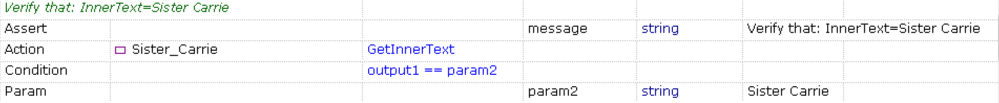
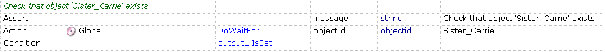

*Assert* is an essential operation for testing and validation. RVL provides special structure for it to make it more readable.

Assertion has 2 parts: 1st row is Assert containing assertion message and then goes [Condition](Conditions.md):

... |*Type*| ...  |*Action*|*ParamName*| ...
--|------|----- |--------|------------|----
    |Assert|      |        | message    | string
    |Param |      |        | param1     |
    |Condition|   | *condition statement*       |            |
    |Param |      |        | param2     |

Assertion first line is always the same except the *Param Value*.

In RVL Action always refers to an operation performed with object.

... |*Type*      |*Object*    |*Action*    | *ParamName* |*ParamType* | *ParamValue*
:-  |:--         |:--         |:--         |:--          |:--         |:--
     | Assert     |            |            |  message    | string     | Assertion text to be displayed in the report           
     | Param      |            |            |  param1     | string     | Text1           
     | Condition  |            | param1!=param2  |             |            |            
     | Param      |            |            |  param2     | string     | Text2           

## Examples

Compare object property *InnerText* with expected value:

Check if object exists on the screen:

Check if variable `Age` has value '74':

