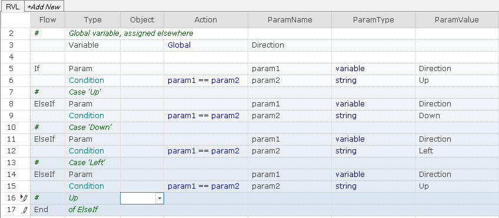

# Conditions

Conditions are used in `If` and `Assert` statements.

## Types of Conditions

A condition accepts one or two [Params](Params.md).

1.  A condition may have just one *Param*. This is called a *unary* condition, for example, `param1 is true` or `output1 is true`.
2.  A condition may have a second *Param*. This is called a *binary* condition, for example, `param1 == param2`.
3.  A condition parameter may be either a *Param* or an *Action* output.
4.  A *Param* is a fixed *value*, *variable*, or *expression*.

Binary condition with two *Param*s named `param1` and `param2`:

| ... | Type      | ... | Action             | ParamName | ... |
| --- | --------- | --- | ------------------ | --------- | --- |
|     | Param     |     |                    | param1    |     |
|     | Condition |     | *param1 == param2* |           |     |
|     | Param     |     |                    | param2    |     |

Binary condition with *Action* and *Param* named `output1` and `param2`:

| ... | Type      | Object   | Action              | ParamName | ... |
| --- | --------- | -------- | ------------------- | --------- | --- |
|     | Action    | MyButton | GetText             |           |     |
|     | Condition |          | *output1 == param2* |           |     |
|     | Param     |          |                     | param2    |     |

Binary condition with two *Action*s named `output1` and `output2`:

| ... | Type      | Object    | Action               | ParamName | ... |
| --- | --------- | --------- | -------------------- | --------- | --- |
|     | Action    | MyButton1 | GetText              |           |     |
|     | Condition |           | *output1 != output2* |           |     |
|     | Action    | MyButton2 | GetText              |           |     |

Unary condition with *Param* `param1`:

| ... | Type      | ... | Action           | ParamName | ... |
| --- | --------- | --- | ---------------- | --------- | --- |
|     | Param     |     |                  | param1    |     |
|     | Condition |     | *param1 IsFalse* |           |     |

Unary condition with *Action* `output1`:

| ... | Type      | Object   | Action           | ParamName | ... |
| --- | --------- | -------- | ---------------- | --------- | --- |
|     | Action    | MyButton | GetEnabled       |           |     |
|     | Condition |          | *output1 IsTrue* |           |     |

## All Conditions

### Unary conditions with *Param*

| *Caption*          | *Description*                                                      |
| ------------------ | ------------------------------------------------------------------ |
| `param1` IsTrue    | Checks if `param1` is true.                                        |
| `param1` IsFalse   | Checks if `param1` is false.                                       |
| `param1` IsNull    | Checks if `param1` is null.                                        |
| `param1` IsNotNull | Checks if `param1` is NOT null.                                    |
| `param1` IsSet     | Checks if `param1` is NOT null, false, 0, an empty string, or undefined. |
| `param1` IsNotSet  | Checks if `param1` is null, 0, false, an empty string, or undefined.   |

### Unary conditions with *Action*

| *Caption*           | *Description*                                                       |
| ------------------- | ------------------------------------------------------------------- |
| `output1` IsTrue    | Checks if `output1` is true.                                        |
| `output1` IsFalse   | Checks if `output1` is false.                                       |
| `output1` IsNull    | Checks if `output1` is null.                                        |
| `output1` IsNotNull | Checks if `output1` is NOT null.                                    |
| `output1` IsSet     | Checks if `output1` is NOT null, false, 0, an empty string, or undefined. |
| `output1` IsNotSet  | Checks if `output1` is null, 0, false, an empty string, or undefined.   |

### Binary conditions with *Param*s

| *Caption*                   | *Description*                                                    |
| --------------------------- | ---------------------------------------------------------------- |
| `param1` == `param2`        | Checks if `param1` is equal to `param2`.                         |
| `param1` != `param2`        | Checks if `param1` is NOT equal to `param2`.                     |
| `param1` > `param2`         | Checks if `param1` is greater than `param2`.                     |
| `param1` >= `param2`        | Checks if `param1` is greater than or equal to `param2`.         |
| `param1` <= `param2`        | Checks if `param1` is less than or equal to `param2`.            |
| `param1` < `param2`         | Checks if `param1` is less than `param2`.                        |
| `param1` contains `param2`  | Checks if `param1` contains `param2` as a substring.             |
| CmpImage `param1`, `param2` | Compares the first image with the image represented by `param2`. |

### Binary conditions with *Action* and *Param*

| *Caption*                    | *Description*                                                    |
| ---------------------------- | ---------------------------------------------------------------- |
| `output1` == `param2`        | Checks if `output1` is equal to `param2`.                        |
| `output1` != `param2`        | Checks if `output1` is NOT equal to `param2`.                    |
| `output1` > `param2`         | Checks if `output1` is greater than `param2`.                    |
| `output1` >= `param2`        | Checks if `output1` is greater than or equal to `param2`.        |
| `output1` <= `param2`        | Checks if `output1` is less than or equal to `param2`.           |
| `output1` < `param2`         | Checks if `output1` is less than `param2`.                       |
| `output1` contains `param2`  | Checks if `output1` contains `param2` as a substring.            |
| CmpImage `output1`, `param2` | Compares the first image with the image represented by `param2`. |

### Binary conditions with *Action*s

| *Caption*                     | *Description*                                                     |
| ----------------------------- | ----------------------------------------------------------------- |
| `output1` == `output2`        | Checks if `output1` is equal to `output2`.                        |
| `output1` != `output2`        | Checks if `output1` is NOT equal to `output2`.                    |
| `output1` > `output2`         | Checks if `output1` is greater than `output2`.                    |
| `output1` >= `output2`        | Checks if `output1` is greater than or equal to `output2`.        |
| `output1` <= `output2`        | Checks if `output1` is less than or equal to `output2`.           |
| `output1` < `output2`         | Checks if `output1` is less than `output2`.                       |
| `output1` contains `output2`  | Checks if `output1` contains `output2` as a substring.            |
| CmpImage `output1`, `output2` | Compares the first image with the image represented by `output2`. |

## *And*, *Or* Conditions

It is possible to create more complex conditions by using the *And* and *Or* keywords in the *Flow* column.

| Flow    | Type      | Object | Action           | ParamName | ParamType  | ParamValue |
| ------- | --------- | ------ | ---------------- | --------- | ---------- | ---------- |
| If      | Param     |        |                  | param1    | *variable* | `Result1`  |
|         | Condition |        | *param1 IsFalse* |           |            |            |
| **And** | Param     |        |                  | param1    | *variable* | `Result2`  |
|         | Condition |        | *param1 IsTrue*  |           |            |            |
| #       | If Block  |        |                  |           |            |            |
| End     | of If     |        |                  |           |            |            |

This example forms a condition that checks if `Result1` is false AND `Result2` is true.

| Flow   | Type      | Object   | Action            | ParamName | ParamType  | ParamValue |
| ------ | --------- | -------- | ----------------- | --------- | ---------- | ---------- |
| If     | Action    | MyButton | GetEnabled        |           |            |            |
|        | Condition |          | *output1 IsFalse* |           |            |            |
| **Or** | Param     |          |                   | param1    | *variable* | `Result1`  |
|        | Condition |          | *param1 IsTrue*   |           |            |            |
| #      | If Block  |          |                   |           |            |            |
| End    | of If     |          |                   |           |            |            |

This example forms a condition that checks if *MyButton* is not enabled OR `Result1` is true.

## Examples

A condition is never used alone. You can find examples of conditions in the chapters on [Assertions](Assertions.md) and [If-Then-Else](IfElse.md).

## Short Condition Syntax

All binary conditions with `param2` take 3 rows. Sometimes it is more convenient to use a shorter, 2-row syntax where the `param2` value is specified on the same row as the condition itself:

| Flow | Type      | Object | Action             | ParamName  | ParamType | ParamValue |
| ---- | --------- | ------ | ------------------ | ---------- | --------- | ---------- |
|      | Param     |        |                    | param1     | ...       | ...        |
|      | Condition |        | *param1 == param2* | **param2** | ...       | ...        |
|      |           |        |                    |            |           |            |

Here is the same condition presented in 3-row (default) and 2-row (short) forms:

=== "Screenshot"
    
=== "Transcript"
    
    | Flow | Type                     | Object | Action           | ParamName | ParamType | ParamValue |
    | ---- | ------------------------ | ------ | ---------------- | --------- | --------- | ---------- |
    | #    | 3 rows condition         |        |                  |           |           |            |
    | If   | Param                    |        |                  | param1    | string    | TBD        |
    |      | Condition                |        | param1 == param2 |           |           |            |
    |      | Param                    |        |                  | param2    | string    | TBD        |
    | End  | of If                    |        |                  |           |           |            |
    | #    | Same condition in 2 rows |        |                  |           |           |            |
    | If   | Param                    |        |                  | param1    | string    | TBD        |
    |      | Condition                |        | param1 == param2 | param2    | string    | TBD        |
    | End  | of If                    |        |                  |           |           |            |
    

The 2-row condition syntax, together with [If-Else](IfElse.md), can be used to mimic a `switch` statement:

=== "Screenshot"
    
=== "Transcript"
    | Flow   | Type                                | Object | Action           | ParamName | ParamType | ParamValue |
    | ------ | ----------------------------------- | ------ | ---------------- | --------- | --------- | ---------- |
    | #      | Global variable, assigned elsewhere |        |                  |           |           |            |
    |        | Variable                            |        | Global           | Direction |           |            |
    | If     | Param                               |        |                  | param1    | variable  | Direction  |
    |        | Condition                           |        | param1 == param2 |           |           |            |
    |        | Param                               |        |                  | param2    | string    | Up         |
    | #      | Case 'Up'                           |        |                  |           |           |            |
    | ElseIf | Param                               |        |                  | param1    | variable  | Direction  |
    |        | Condition                           |        | param1 == param2 |           |           |            |
    |        | Param                               |        |                  | param2    | string    | Down       |
    | #      | Case 'Down'                         |        |                  |           |           |            |
    | ElseIf | Param                               |        |                  | param1    | variable  | Direction  |
    |        | Condition                           |        | param1 == param2 | param2    | string    | Left |
    | #      | Case 'Left'                         |        |                  |           |           |            |
    | ElseIf | Param                               |        |                  | param1    | variable  | Direction  |
    |        | Condition                           |        | param1 == param2 |           |           |            |
    |        | Param                               |        |                  | param2    | string    | Right      |
    | #      | Case 'Right'                        |        |                  |           |           |            |
    | End    | of ElseIf                           |        |                  |           |           |            |

When using an `Action` result instead of a `param`, it is recommended to first save the result to a [Variable](Variables.md).