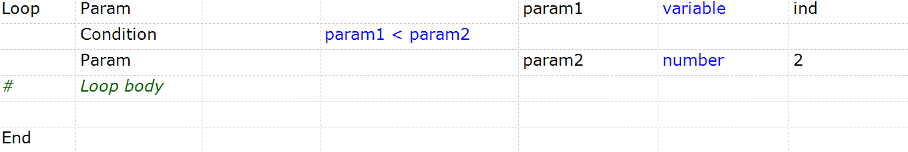

# Loops

*Loops* serve several purposes in RVL:

1.  Iterate through [Maps](Maps.md) to make data-driven testing easier.
2.  Repeat a set of actions for a specified number of iterations.
3.  Repeat a loop body while a [Condition](Conditions.md) is satisfied.

### Loop Map

A [Map](Maps.md) allows you to read script data from a table defined in the same script or from an external data source, such as a spreadsheet, file, or database. Once a Map is defined, a loop is the simplest way to traverse it.

| Flow | Type  | Object    | Action | ParamName | ParamType | ParamValue |
| ---- | ----- | --------- | ------ | --------- | --------- | ---------- |
| Loop | `Map` | *MapName* |        |           |           |            |
|      | ...   |           | ...    | ...       | ...       | ...        |
|      |       |           |        |           |           |            |
| End  |       |           |        |           |           |            |

Where *MapName* should be the name of the map declared earlier in the same script.

The loop iterates through either the map rows or the map columns, depending on the map type:

*   For `Rows`, `Range`, or `Database` map types, the loop iterates through the rows. For example, the first iteration corresponds to the first row, the second iteration corresponds to the second row, and so on.
*   For `Columns` and `Table` map types, the loop iterates through the columns.

### Loop Variable

=== "Screenshot"
    
=== "Transcript"
    | Flow | Type      | Object | Action | ParamName | ParamType | ParamValue |
    | ---- | --------- | ------ | ------ | --------- | --------- | ---------- |
    | Loop | Variable  | i      |        | from      | number    | 1          |
    |      | Param     |        |        | to        | number    | 10         |
    | #    | Loop body |        |        |           |           |            |
    | End  |           |        |        |           |           |            |

| Flow | Type         | Object    | Action | ParamName | ParamType | ParamValue   |
| ---- | ------------ | --------- | ------ | --------- | --------- | ------------ |
| Loop | **Variable** | *VarName* |        | `from`    | number    | *from value* |
|      | Param        |           |        | `to`      | number    | *to value*   |
|      | Param        |           |        | `step`    | number    | *step value* |
|      | ...          |           | ...    | ...       | ...       | ...          |
| End  |              |           |        |           |           |              |

Where:

*   *VarName* is the optional name of a variable. It can be omitted if the goal is simply to perform a specified number of iterations. If *VarName* is set, the corresponding variable is assigned the `from` value and is incremented in each iteration until it reaches the `to` value. If *VarName* refers to an existing local or global variable, that variable is used. Otherwise, a new local variable named *VarName* is created.

*   *from* The initial value of the loop variable.
*   *to* The final value of the loop variable.
*   *step* The value by which the variable is incremented in each iteration. This parameter is optional and defaults to 1.

### Loop Condition

=== "Screenshot"
    
=== "Transcript"
    | Flow | Type      | Object | Action          | ParamName | ParamType | ParamValue |
    | ---- | --------- | ------ | --------------- | --------- | --------- | ---------- |
    | Loop | Param     |        |                 | param1    | variable  | ind        |
    |      | Condition |        | param1 < param2 |           |           |            |
    |      | Param     |        |                 | param2    | number    | 2          |
    | #    | Loop body |        |                 |           |           |            |
    | End  |           |        |                 |           |           |            |

The loop repeats as long as the condition is satisfied (e.g., `while( param1 < param2 )`).