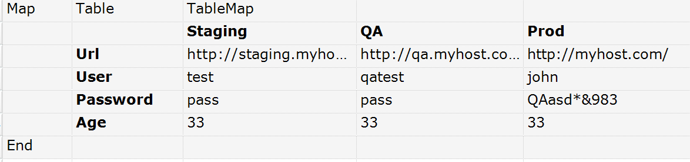
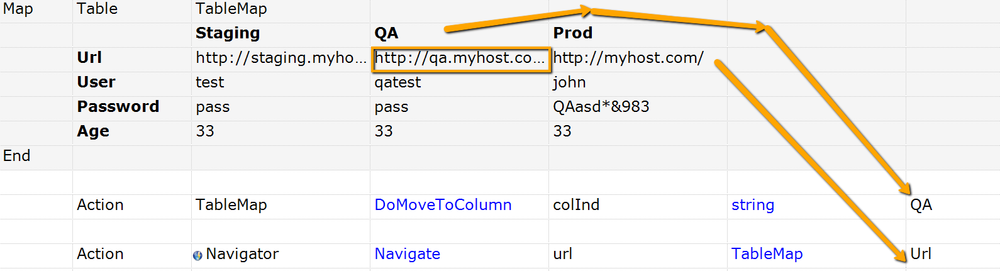

# Maps

A *Map* is designed to be an easy way to define tables of data. Items in the map may be accessed by name (if defined) or by index.

The indexed dimensions in the map may also be iterated by the [Loop][Loops.md] function, thus making it useful feature for Data-Driven Testing.

=== "Screenshot"
    
=== "Transcript"
    | Flow | Type      | Object       | Action | ParamName | ParamType | ParamValue |
    | ---- | --------- | ------------ | ------ | --------- | --------- | ---------- |
    | Map  | Rows      | Logins       |        |           |           |            |
    |      | **Login** | **Password** |        |           |           |            |
    |      | John      | pass1        |        |           |           |            |
    |      | Sarah     | pass2        |        |           |           |            |
    | End  | of Map    |              |        |           |           |            |

An RVL script has at least 7 [columns](Columns.md). However the *Map* may take as many columns as needed.

## Map Definition

Typical declaration of map looks like:

| Flow  | Type      | Object      | Action | ParamName | ParamType | ParamValue |
| ----- | --------- | ----------- | ------ | --------- | --------- | ---------- |
| *Map* | `MapType` | **MapName** |        |           |           |            |
| ...   | ...       | ...         |        |           |           |            |
| *End* |           |             |        |           |           |            |

Where `MapType` is either inplace: *Table*, *Rows*, *Columns*, or external: *Range* or *Database*.

### In-place Maps

In-place map data is defined right in the RVL script. In-place map rows may be selected using *This* flow or skipped with a [Comment](Comments.md). So in-place maps serve as a part of the executable script.

* *Table*
* *Rows*
* *Columns*

### External Maps

* *Range*
* *Database*

External maps are defined in an external spreadsheet, file or a database.

## Using Maps

Once map is defined it may be used as a regular [Object](../Libraries/Map.md). 

=== "Screenshot"
    
=== "Transcript"
    | Flow | Type                                     | Object   | Action       | ParamName | ParamType | ParamValue |
    | ---- | ---------------------------------------- | -------- | ------------ | --------- | --------- | ---------- |
    | Map  | Rows                                     | Logins   |              |           |           |            |
    |      | Login                                    | Password |              |           |           |            |
    |      | John                                     | pass1    |              |           |           |            |
    |      | Sarah                                    | pass2    |              |           |           |            |
    | End  | of Map                                   |          |              |           |           |            |
    | #    | Move to next sequential row in Login map |          |              |           |           |            |
    |      | Action                                   | Login    | DoSequential |           |           |            |
    

### Reading in a Loop

See [Loops](Loops.md#Map) part for `Map` type of loops.

## Maps Types

### Rows Map

A `Rows` Map is the most useful for data feeds. Each of the set of values is a row in a table that look like:

| Flow  | Type     | Object        | Action   | ParamName | ParamType | ParamValue |
| ----- | -------- | ------------- | -------- | --------- | --------- | ---------- |
| *Map* | `Rows`   | ***MapName*** |          |           |           |            |
|       | **Col1** | **Col2**      | **Col3** | **Col4**  |           |            |
|       | val11    | val12         | val13    | val14     |           |            |
|       | ...      |               |          |           |           |            |
|       | ...      |               |          |           |           |            |
| *End* |          |               |          |           |           |            |

`This` and comments are specific features of the `Rows` Map. For example, only the 2nd row of data will be executed in this case:

| Flow       | Type      | Object        | Action   | ParamName | ParamType | ParamValue |
| ---------- | --------- | ------------- | -------- | --------- | --------- | ---------- |
| *Map*      | `Rows`    | ***MapName*** |          |           |           |            |
|            | **Col1**  | **Col2**      | **Col3** | **Col4**  |           |            |
|            | ...       |               |          |           |           |            |
| ***This*** | ***...*** |               |          |           |           |            |
|            | ...       |               |          |           |           |            |
| *End*      |           |               |          |           |           |            |

`Rows` are designed to be iterated in a [Loop](Loops.md)

In real example it looks like this:

=== "Screenshot"
    
=== "Transcript"
    | Flow | Type      | Object       | Action | ParamName | ParamType | ParamValue |
    | ---- | --------- | ------------ | ------ | --------- | --------- | ---------- |
    | Map  | Rows      | MyMap1       |        |           |           |            |
    |      | **Login** | **Password** |        |           |           |            |
    |      | John      | testpass     |        |           |           |            |
    |      | Sarah     | testpass     |        |           |           |            |
    | This | Jim       | testpass     |        |           |           |            |
    |      | Peter     | testpass     |        |           |           |            |
    |      | John      | testpass     |        |           |           |            |
    |      | Fred      | testpass     |        |           |           |            |
    | End  |           |              |        |           |           |            |
    

[Comments](Comments.md) may also be used to skip specific rows or row sets.

### Columns Map

A `Columns` Map is a convenient way for representing data when you have many options combined in few sets. 

| Flow  | Type      | Object        | Action | ParamName | ParamType | ParamValue |
| ----- | --------- | ------------- | ------ | --------- | --------- | ---------- |
| *Map* | `Columns` | ***MapName*** |        |           |           |            |
|       | **Row1**  | ...           |        |           |           |            |
|       | **Row2**  | ...           |        |           |           |            |
|       | **Row3**  | ...           |        |           |           |            |
| *End* |           |               |        |           |           |            |

The same may be represented as `Rows` but would require many columns and sometimes it is harder to read. So columns is ideal for storing configuration structures:

=== "Screenshot"
    
=== "Transcript"
    
    | Flow | Type     | Object                 | Action | ParamName | ParamType | ParamValue |
    | ---- | -------- | ---------------------- | ------ | --------- | --------- | ---------- |
    | Map  | Columns  | ConfigData             |        |           |           |            |
    |      | Url      | http://localhost:8080/ |        |           |           |            |
    |      | Login    | testuser               |        |           |           |            |
    |      | Password | testpass               |        |           |           |            |
    |      | Age      | 44                     |        |           |           |            |
    | End  |          |                        |        |           |           |            |
    

When a `Columns` Map is used in the Loop, then the iteration is performed through the columns and addresses the rows by name within the loop. I.e. the 1st iteration chooses 1st column, 2nd goes to 2nd column and so on.

### Table Map

A Table map has both columns and rows named.

| Flow  | Type     | Object        | Action   | ParamName | ParamType | ParamValue |
| ----- | -------- | ------------- | -------- | --------- | --------- | ---------- |
| *Map* | `Table`  | ***MapName*** |          |           |           |            |
|       |          | **Col1**      | **Col2** | **Col3**  | **Col4**  |            |
|       | **Row1** | ...           |          |           |           |            |
|       | **Row2** | ...           |          |           |           |            |
|       | **Row3** | ...           |          |           |           |            |
| *End* |          |               |          |           |           |            |

=== "Screenshot"
    
=== "Transcript"
    
    | Flow | Type     | Object                 | Action                 | ParamName          | ParamType | ParamValue |
    | ---- | -------- | ---------------------- | ---------------------- | ------------------ | --------- | ---------- |
    | Map  | Table    | TableMap               |                        |                    |           |            |
    |      |          | Staging                | QA                     | Prod               |           |            |
    |      | Url      | http://staging.myho... | http://qa.myhost.co... | http://myhost.com/ |           |            |
    |      | User     | test                   | qatest                 | john               |           |            |
    |      | Password | pass                   | pass                   | QAasd*&8983        |           |            |
    |      | Age      | 33                     | 33                     | 33                 |           |            |
    | End  |          |                        |                        |                    |           |            |
    |      |          |                        |                        |                    |           |            |
    

When a `Table` Map is used in the Loop, then the iteration is performed through the columns and addresses the rows by name within the loop. I.e. 1st iteration chooses 1st column, 2nd goes to 2nd column and so on.

It is convenient to use a `Table` Map when you have several columns and many rows so it perfectly fits into the screen. For example you may have several alternative configuration sections and want to use them depending on the situation. In the example below we have several sites (Testing, QA, Prod) each having own Url, Login etc. So we want to quickly switch between sites when working with test.

=== "Screenshot"
    
=== "Transcript"
    | Flow | Type     | Object                 | Action                | ParamName          | ParamType | ParamValue |
    | ---- | -------- | ---------------------- | --------------------- | ------------------ | --------- | ---------- |
    | Map  | Table    | TableMap               |                       |                    |           |            |
    |      |          | Staging                | QA                    | Prod               |           |            |
    |      | Url      | http://staging.myho... | http://qa.myhost.com/ | http://myhost.com/ |           |            |
    |      | User     | test                   | qatest                | john               |           |            |
    |      | Password | pass                   | pass                  | QAasd*&8983        |           |            |
    |      | Age      | 33                     | 33                    | 33                 |           |            |
    | End  | of Map   |                        |                       |                    |           |            |
    |      |          |                        |                       |                    |           |            |
    |      | Action   | TableMap               | DoMoveToColumn        | colInd             | string    | QA         |
    |      | Action   | Navigator              | Open                  | url                | TableMap  | Url        |

### Range Map

`Range` map contains no in-place data, but defines a region in the external spreadsheet to read information from.

=== "Screenshot"
    
=== "Transcript"
    | Flow | Type  | Object | Action | ParamName | ParamType | ParamValue |
    | ---- | ----- | ------ | ------ | --------- | --------- | ---------- |
    | Map  | Range | MyMap1 |        | fileName  | string    | Calc.xls   |
    |      | Param |        |        | sheetName | string    | Data$      |
    |      | Param |        |        | fromRow   | number    | 0          |
    |      | Param |        |        | fromCol   | number    | 0          |
    |      | Param |        |        | toRow     | number    | 2          |
    |      | Param |        |        | toCol     | number    | 10         |
    | End  |       |        |        |           |           |            |
    

A `Range` map definition contains a number of required parameters:

* *fileName* Path to file containing data.  It may point to .xls, .xlsx or .csv file. If when it is empty we assume that data is stored in the same .rvl.xls spreadsheet as the script.
* *sheetName* Excel Sheet name. May be empty for .csv spreadsheets.
* *fromRow* 0-based index of the first row containing data. Usually first row is assigned as a header containing column names.
* *fromCol* 0-based index of the first column containing data.
* *toRow* final row index. If set to -1 then final row is detected automatically (as last row containing some data in the 1st column)
* *toCol* final column index. If set to -1 then final column is detected automatically as last column containing data in the 1st row.

Also there are a hidden parameters:

* *chooseRow* select rows with matching value of the 1st column. May be used to pre-select some specific row in a Map. For example, if Map contains credentials, and 1st column is *User Name* then `chooseRow=Some Name` limits a Map to that user.
* *hasColumnNames* boolean. By default it is `true` meaning that 1st rows is assumed to contain column names. Once it is `false` the columns will have no names and may only be accessed by 0-based index.

Data in the `Range` map is assumed to be similar to [`Rows`](#rows-map) map, but defined externally. Looping is done by rows. Typical external file containing data may look like that:

=== "Screenshot"
    
=== "Transcript"
    | A     | B         | C     | C      |
    | ----- | --------- | ----- | ------ |
    | Item1 | Operation | Item2 | Result |
    | 15    | +         | 13    | 28     |
    | 5     | *         | 6     | 30     |
    | 19    | -         | 3     | 16     |
    | 8     | /         | 4     | 2      |

### Database Map

A `Database` map contains no in-place data, but defines a connection to the database result set. 

=== "Screenshot"
    
=== "Transcript"
    | Flow | Type     | Object | Action | ParamName        | ParamType | ParamValue             |
    | ---- | -------- | ------ | ------ | ---------------- | --------- | ---------------------- |
    | Map  | Database | MyMap1 |        | connectionString | string    | MYSQL1                 |
    |      | Param    |        |        | query            | string    | select * from contacts |
    | End  |          |        |        |                  |           |                        |
    

The `Database` map definition contains two parameters:

* *connectionString* ADO connection string. 
* *query* usually it is an SQL query to execute.

*connectionString* parameter allows accessing wide variety of different database sources. You may learn ore here: [https://docs.microsoft.com/en-us/sql/ado/reference/ado-api/connectionstring-property-ado](https://docs.microsoft.com/en-us/sql/ado/reference/ado-api/connectionstring-property-ado).

Some samples of typical ADO connection string values:

#### Microsoft Access

    Provider=MSDASQL; Driver={Microsoft Access Driver (*.mdb)}; DBQ=C:\path\filename.mdb;

#### Microsoft Excel

    Provider=MSDASQL; Driver={Microsoft Excel Driver (*.xls)}; DBQ=C:\path\filename.xls;

#### Microsoft Text

    Provider=MSDASQL; Driver={Microsoft Text Driver (*.txt; *.csv)}; DBQ=C:\path\;

An example below refers to ODBC Data Source defined as follows:

=== "Screenshot"
    
=== "Transcript"
    Screenshot start Maps_DatabaseODBC.png
    
    [ODBC Data Source Administrator (32-bit)]
    
    - **User DSN** | **System DSN** | **File DSN** | **Drivers** | **Tracing** | **Connection Pooling** | **About**
    
      - **System Data Sources:**
        - Name: MYSQL1
        - Platform: 32-bit
        - Driver: MySQL ODBC 5.1 Driver
    
      - [Add...] [Remove] [Configure...]
    
      - An ODBC System data source stores information about how to connect to the indicated data provider. A System data source is visible to all users of this computer, including NT services.
    
      - [OK] [Cancel] [Apply] [Help]
    
    Screenshot end Maps_DatabaseODBC.png
