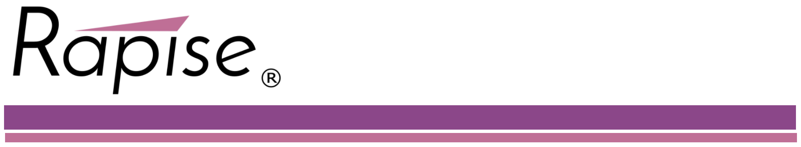

RVL stands for **Rapise Visual Language**. It is inspired by well known software testing methodologies *Keyword Driven Testing* and *Data Driven Testing*.

This section contains a review of current approaches and concepts to highlight the ideas behind RVL design. You don't need to read this section if you want to learn RVL. However you may need it if you want to understand how it compares to other approaches and why we believe it is not just yet another approach but the way forward to diminish struggling while building real live UI Automation.

### Keyword Driven Testing

[Keywoard Driven Testing](https://en.wikipedia.org/wiki/Keyword-driven_testing) separates the documentation of test cases -including the data to use- from the prescription of the way the test cases are executed. As a result it separates the test creation process into two distinct stages: a design and development stage, and an execution stage.

**A**         |    **B**       |      **C**        |     **D**
--------------|----------------|-------------------|--------------
 .            | *First Name*   | *Last Name*       | *Age*
Enter Patient | John           | Smith             | 45
Enter Patient | Sarah          | Connor            | 32

*Keyword Driven Testing*: Column *A* constains a *Keyword*, columns *B*, *C*, *D* provide parameters for a *Keyword*.


### Data Driven Testing

[Data Driven Testing](https://en.wikipedia.org/wiki/Data-driven_testing) is the creation of test scripts to run together with their related data sets in a framework. The framework provides re-usable test logic to reduce maintenance and improve test coverage. Input and result (test criteria) data values can be stored in one or more central data sources or databases, the actual format and organization can be implementation specific.

**A**         |    **B**       |      **C**        
--------------|----------------|-------------------
*First Name*  | *Last Name*       | *Age*
John          | Smith             | 45
Sarah         | Connor            | 32

*Data Driven Testing*: We have test input and expected output in data sources.

### Gherkin / Cucumber
There are known approaches intended to make scripting more close to spoken languages. 

This is a very wise approach improving test readability. The test case is described in [Gherkin](https://github.com/cucumber/cucumber/wiki/Gherkin) - business readable, domain specific language. It describes behavior without detailing how that behavior is implemented.

Essential part of this framework is implementation of Given-When-Then steps that should be done with one of the common programming languages. Here is the place where the need in scriping skills are still required.

## Why RVL?
Initially Rapise has everything to build *Data Driven* and *Keyword Driven* test frameworks. Even without RVL. 

It is possible do define *scenarios* or *keywords*, connect to *Spreadsheet* or *Database* and build the test set.

Framework based approaches require one to split data from test logic and maintain them separately. So:
* When *AUT* or *SUT* changes (new theme, new widget, new layout) then test logic is updated and data stays the same
* When test scenarios are enriched or updated then test logic is kept intact and only data sheets are updated.

The reality of this approach leads to some challenges. These challenges are common for all test frameworks mentioned here. 

1. Design of test scripts require scripting and programming skills. That person is likely to be a programmer. 
2. Design of good test data requires knowledge in target domain. For example, if you application is for Blood Bank then one should have some medical skills. If it is some device control app, then you should have engeneering knowledge about physical limitations of the device.

So in ideal world there are two persons working as a team: UI Automation scripting expert and target domain specialist.

In reality we see that due to real life limitations it is common that all scripting and test data is done by one person. It is either a programmer who gets familiar with target AUT domain or analyst who has some scripting skills.

### Reasons for struggling
There are several reasons that make a learning curve longer and adoption harder.

#### Syntax Sugar
We found a reason why people get stuck while trying to implement a test case.

Most of programming languages including *JavaScript* were designed by people with mathematical background.  So this statement appears clear and simple for a programmer:

```javascript
Deposit('John', 'O\'Connor', 17.99);
```
Programmer easily reads this as:

    Deposit $17.99 to John O'Connor

So what is the difference between these notations? We found that the first and most important difficulty lays in so called *syntactical sugar*. Symbols `' " ; , . ( ) [ ] { } & $ % # @` do have meaning for language notation however are not important for understainding the matter.

This is true even for programmers. When switching from similarly looking languages some differences easily cause frustration. For example, the same construct:
```
$a = "Number " + 1;
```
Means text concatenation in *JavaScript*, however the same is mathematical operation in *PHP*. 

Comparison like:
```
if( value == "OK" )
```

Is good for *JavaScript* or *C#* world and leads `false` results in *Java*.

So even if we have programming skills it is still a problem to switch from one language to another and may produce potential issues.

### Data Tables
With Keywword Driven and Data Driven approach we get a table that represents a sequence. Sequence of patients to proceed, sequence of user logins etc. 

And sometimes we feel the lack of common debugging facilities:
- run keyword for only one line,
- start from specific row,
- or stop before processing specific line.

So here we get to a point where the table should better be a part of the script rather than just external data source.

### State of The Art
RVL reflects a common trend in programming languages where computational power and flexibility are sacrificed towards clarity and readability.

Some language is reduced to a reasonable subset in the sake of more concise and focused presentation. Just couple of examples.


[Jade](http://learnjade.com/) template engine simplifies writing HTML pages by clearing syntax sugar (`< > / %`) so HTML code:
```
  <body>
    <p class="greeting">Hello, World!</p>
  </body>
```
Gets reduced to more textual view:
```
    body
        p.greeting Hello, World!
```

[Go](https://golang.org/) language is promoted as *Go is expressive, concise, clean, and efficient.*. In fact its authors sacrificed many advanced features of common programming languages (classes, inheritance, templates) to get more clarity. This is extremely important because sophisticated features produce sophisticated problems that are hard to nail down. And if you deal with high-load distributed systems minor gain through use of unclear feature may lead to major unpredictable loss.


## RVL Concepts
RVL's goal is to minimize the struggling. 

1. We assume that one should have minimal care about the syntax sugar and syntax rules. This means that we must avoid braces, quotes or any special symbols `' " ; , . ( ) [ ] { } & $ % # @` and make it possible to maintain the script without them.
2. We want script to be close to *Keyword Driven* and *Data Driven* testing concept. So test data and test results should be representable as data tables. This reduces the struggling of attaching the data feed to a test set.
3. We still want to have a solid language. We seek for a balance between clarity and power of language. So we want the script to be implemented on the same language. Both keyword, scenarios and data feeds should be done in a same way. This means one RVL skill is requried for everything. 
4. In many cases grids or tables are used to represent test data. So we want the script itself to be a grid. So all parts of it includeing data tables are debuggable as a part of the solid script.
5. When we think about working with table data the most common format that comes to our mind is XLS, XLSX or CSV. These formats are supported by powerful tools that make it easier to prepare data for feeding into the test set. So RVL is itself an .xls spreadsheet so its logic is expressed right there.
6. Even with Spreadsheet there is a question what may be entered into the particular cell. With RVL we have an editor where you start from left to right and each cell has limited number of options. So if you don't know language it will guide you.


