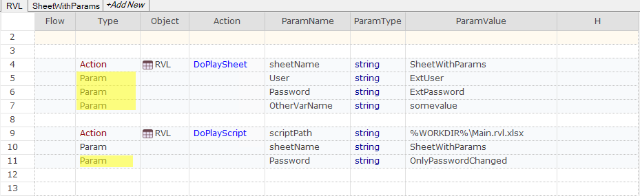

# Params

The last 3 columns in the RVL table are used for passing parameters:

...     | *ParamName* |*ParamType* |*ParamValue*
--------|:--          |:--         |:--
...     |  text       | string     | John Smith
...     |  x          | number     | 5
...     |  y          | number     | 7
...     |  forceEvent | boolean    | true

* The 5th column - *ParamName* - specifies the name of the parameter. While it does not affect execution, it is important for readability and understanding the provided input options. The *ParamName* is significant in cases such as [RVL.DoPlayTest](/Libraries/RVL#doplaytest), [RVL.DoPlaySheet](/Libraries/RVL#doplaysheet), [RVL.SetLocatorOpt](/Libraries/RVL#setlocatoropts), and [RVL.FormatString](/Libraries/RVL#formatstring). See [extra parameters](#extra-parameters) for more information.
* The 6th column - *ParamType* - value type. This may be a basic scalar type (`number`, `string`, `boolean`) as well as one of the following additional 'special' types:
    * `expression` - any valid JavaScript expression that may involve global variables and functions and local variables.
    * `variable` - the parameter value is read from a variable.
    * `objectid` - ID of one of the learned Objects.
    * `password` - means that value is encrypted string that is decrypted in runtime.
    * `relpath` - means path relative to position of the current RVL file. This parameter is automatically translated to a full path before being passed into the action/function.
    * `testparam` - the value of the [parameter](/Guide/Frameworks/parameters) passed to the test.
    * `<mapname>` - see [Map params](#map-params).
* The 7th column - *ParamValue* - specifies the value acceptable for the corresponding *ParamType*. For `boolean`, it can be either `true` or `false`. For `number`, it can be any floating point number (e.g., `3.14`). For `string`, it can be any text without quotes or escape signs. For `relpath`, it should be a valid relative path, and for `testparam`, it is the name of the parameter (e.g., `Browser`).

## Param Rows

In RVL each parameter takes one row:

...|*Type*| ...| *ParamName* | *ParamType*|*ParamValue*
---|----  |----|:--          |:--         |:--
...|Param |    |  text       | string     | John Smith
...|Param |    |  x          | number     | 5
...|Param |    |  y          | number     | 7
...|Param |    |  forceEvent | boolean    | true

## Param Arrays

Some methods accept arrays of values as input values. For example `Tester.Message` may take its 1st `message` parameter as an array and prints them combined. Making an array is easy, several consequent parameters having the same name are combined into an array, i.e.:

*Flow*|*Type* |*Object*    |*Action*    | *ParamName* |*ParamType* |*ParamValue*
:--  |:--     |:--         |:--         |:--          |:--         |:--
     | Action | Tester     | Message    |  **message**| **string** | MyVar1 value: 
     | Param  |            |            |  **message**| **variable**| **MyVar1**           
     | Param  |            |            |  **message**| **string**| MyVar2 value:
     | Param  |            |            |  **message**| **variable**| **MyVar2**           

Should report a message like:

    MyVar1 value: 25 MyVar2 value: 33

## Extra Parameters

Several functions of the [RVL Object](../Libraries/RVL.md) support variable parameters ([`RVL.DoPlaySheet`](RVL_DoPlay.md), [`RVL.DoPlayScript`](RVL_DoPlay.md), [`RVL.SetLocatorOpts`](../Libraries/RVL.md#setlocatoropts), [`RVL.FormatString`](../Libraries/RVL.md#formatstring), [`RVL.DoPlayTest`](../Libraries/RVL.md#doplaytest)) and [`RVL.DoPlayTestParallel`](../Libraries/RVL.md#doplaytestparallel)) support extra parameters.

Custom parameters added by user manually, by specifying row type `Param` and assigning any required param name.

There my be as many extra parameters as needed.

## Mixed Rows

In some cases it is convenient to mix parameter cells with an *Action* or *Condition*. 

For example, the 1st parameter of an *Action* may share the `Action` row:

*Flow*|*Type* |*Object*    |*Action*    | *ParamName* |*ParamType* |*ParamValue*
:--  |:--     |:--         |:--         |:--          |:--         |:--
     | Action | MyButton   | DoClick    |  **x**      | **number** | **5**
     | Param  |            |            |  y          | number     | 7

And this is equivalent to putting it in the next row:

*Flow*|*Type* |*Object*    |*Action*    | *ParamName* |*ParamType* |*ParamValue*
:--  |:--     |:--         |:--         |:--          |:--         |:--
     | Action | MyButton   | DoClick    |             |            | 
     | Param  |            |            |  **x**      | **number** | **5**
     | Param  |            |            |  y          | number     | 7

Or `param2` of the [condition](Conditions.md) may be on the same row:

... |*Type*      |*Object*    |*Action*    | *ParamName* |*ParamType* |*ParamValue*
:-  |:--         |:--         |:--         |:--          |:--         |:--
    | Param      |            |            |  param1     | string     | Text1
    | Condition  |            | param1!=param2  |  **param2**     | **string**     | **Text2**  

Which is equivalent to:

... |*Type*      |*Object*    |*Action*    | *ParamName* |*ParamType* |*ParamValue*
:-  |:--         |:--         |:--         |:--          |:--         |:--
    | Param      |            |            |  param1     | string     | Text1
    | Condition  |            | param1!=param2  |             |            | 
    | Param      |            |            |  **param2**     | **string**     | **Text2**

This allows saving space while keeping same readability. See also [short condition syntax](Conditions.md#short-condition-syntax) for real live example of mixed rows usage.

## Map Params

If map is defined in the script it may be used directly as a parameter. *ParamType* should be set to Map Name and *ParamValue* is a column (or row) name:

