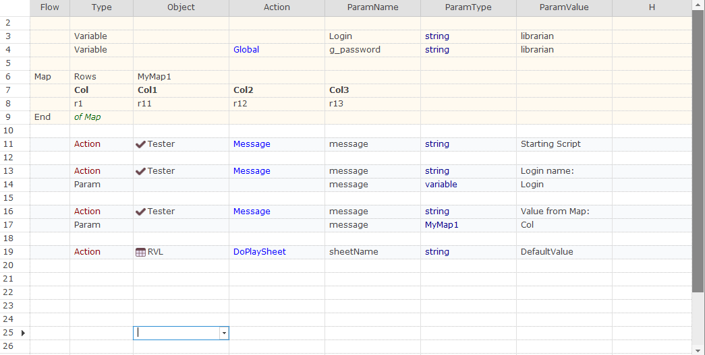

# Sheet Preamble

Preamble is a beginning of each RVL sheet containing common data definitions.

Preamble is executed every time when one does [Play Selection](../Guide/rvl_editor.md#context-menu) or [Play From Here](../Guide/rvl_editor.md#context-menu) in RVL. So if the piece that you try to have executed refers [Variables](Variables.md) or [Maps](Maps.md) then executed statement will 'see' them as if they are part of the selection.

The preamble is detected automatically. Everything before first [Action](Actions.md), [Assertion](Assertions.md), [Loop](Loops.md) or [Condition](Conditions.md) is a preamble.

For example, Preamble here ends at the row 10 (because row 11 is **Action**)
