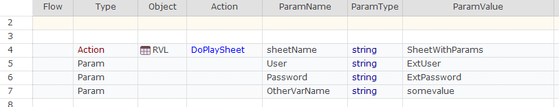
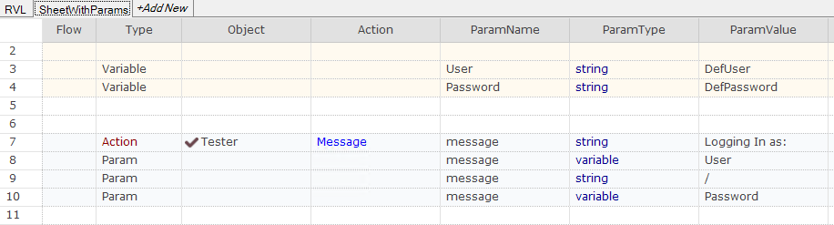

# RVL.DoPlaySheet and RVL.DoPlayScript

```javascript
DoPlayScript(/**String*/scriptPath, /**String*/sheetName)
```

Play RVL sheet `sheetName` from workbook `scriptPath`.

-    `scriptPath` {/**string*/}: Path to script

-    `sheetName` {/**string*/}: Excel sheet containing the script

-    **[extraParams]**: default variable values

```javascript
DoPlaySheet(/**String*/sheetName)
```

Play RVL sheet `sheetName` from current workbook.

-    `sheetName` {/**string*/}: Excel sheet containing the script

-    **[extraParams]**: default variable values

## Passing Input Parameters

[Extra parameters](../RVL/Params.md#extra-parameters) **[extraParams]** used in these calls are default values for local variables defined in the destination scripts.

So the following call:



passes `User=ExtUser`, `Password=ExtPassword`, `OtherVarName=somevalue` to the destination script. It may now be used as follows:



So local variable `User` is assigned to value `ExtUser` when called. However, if you play this sheet using `Play Sheet` then this variable would have value `DefUser`.

This helps to make sheets more universal: it should be possible to execute the sheet or any statement in a sheet alone as well as call it from outside and pass parameters.