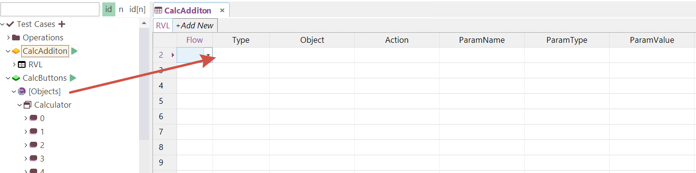
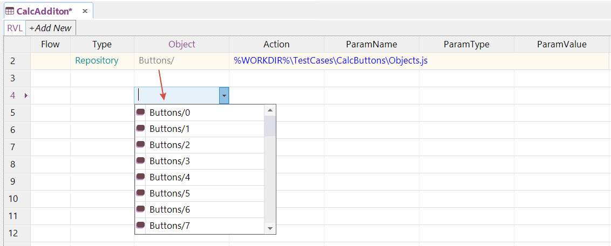
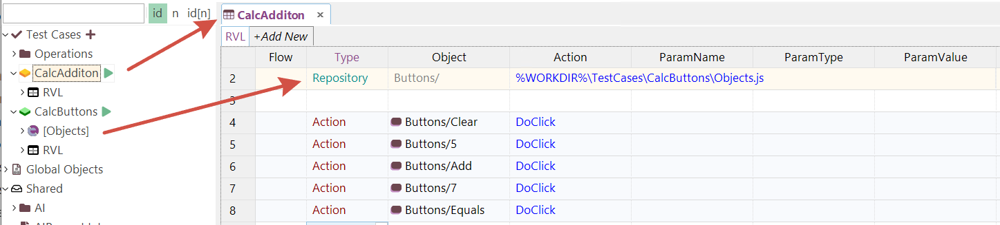
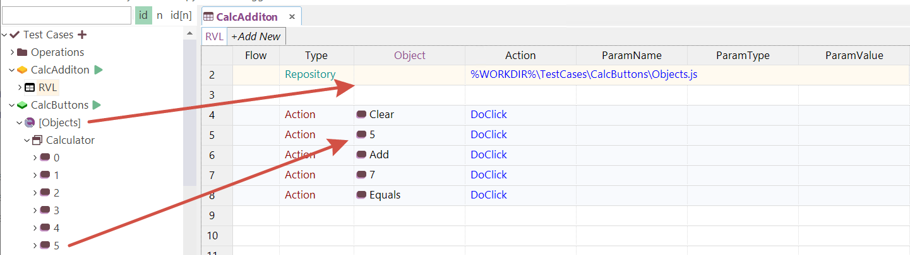
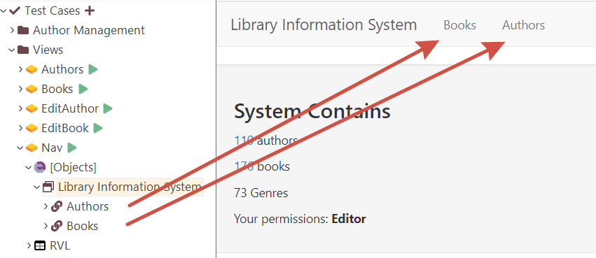
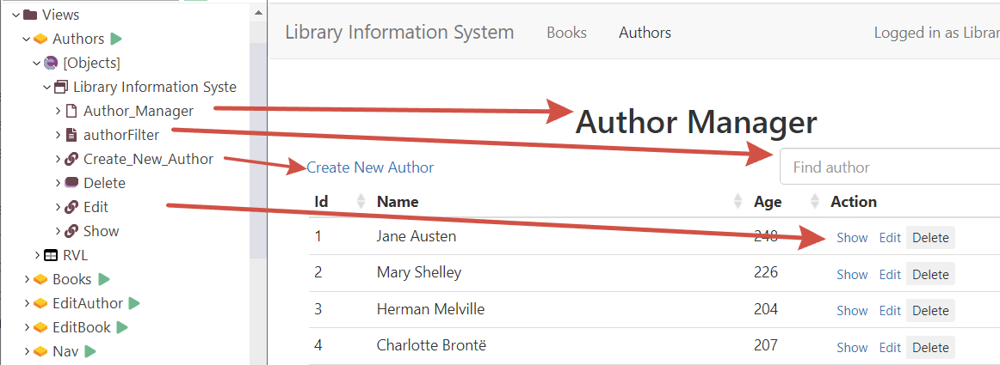
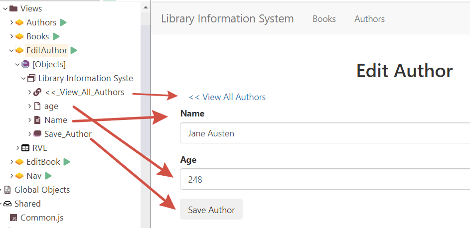
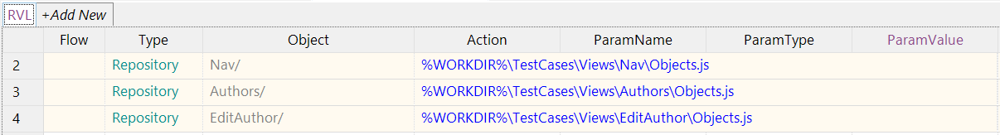
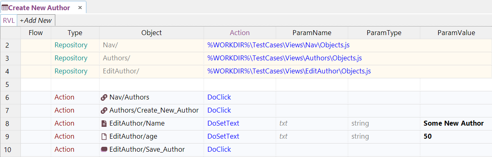
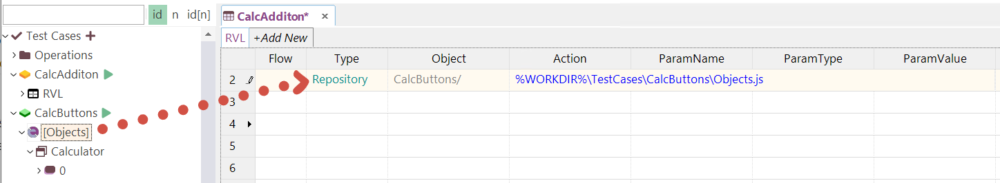

# Repository

In RVL, the Repository declaration is used to import objects from external repositories into the current RVL sheet:

| Flow | Type       | Object   | Action | ParamName | ParamType | ParamValue |
| ---- | ---------- | -------- | ------ | --------- | --------- | ---------- |
|      | Repository | *prefix*<td colspan=4>*path* |           |           |            |

Here, **path** refers to the `Objects.js` file that contains the object definitions, and **prefix** is a string you can specify to be appended to each object's ID.

### Example:

| Flow | Type       | Object   | Action | ParamName | ParamType | ParamValue |
| ---- | ---------- | -------- | ------ | --------- | --------- | ---------- |
|      | Repository | AuthorsView/ | <td colspan=4>%WORKDIR%\TestCases\AuthorManagement\AuthorsView\Objects.js |           |           |            |

In this example, if **AuthorsView** contains a button labeled "Save", it will be accessible in RVL as "AuthorsView/Save".

## Adding an External Repository

Consider a scenario where we have a test case named **CalcButtons** that contains all the buttons from the Calculator application. Now, if we want to use these pre-learned buttons in another scenario called **CalcAddition**:

We can define a **Repository** command to import the objects with a "Buttons/" prefix. This way, all imported objects will appear in the dropdown with the "Buttons/" prefix:

Finally, you can implement the entire scenario using these imported objects:

## Using an Empty Prefix

The previous example can also be implemented with an empty **Repository** prefix, as shown below:

In this case, **Repository** objects are accessed exactly as they are listed in the **Objects** tree.

## Importing Multiple Repositories

Often, it's more practical to divide the object repository into smaller segments and include only those necessary for a specific test case.

Consider a LibraryInformationSystem application with several screens. We've defined multiple test cases in a folder named **Views**, each containing objects from a specific screen.

- **Nav** contains a navigation bar:

  

- **Authors** contains an author list:

  

- **EditAuthor** contains controls for an author editor form:

  

Now, if we want to implement a scenario where a new author is created, we need to navigate to the **Authors** view using the link from the Nav bar, click the **Create New Author** link, and then fill out the **Edit Author** form.

We can achieve this by including objects from each of these views using the `Repository` command with the respective prefix values: **Nav/**, **Authors/**, and **EditAuthor/**.

=== "Screenshot"
    
=== "Transcript"
    | Flow | Type       | Object   | Action | ParamName | ParamType | ParamValue |
    | ---- | ---------- | -------- | ------ | --------- | --------- | ---------- |
    |      | Repository | Nav/ | <td colspan=4>%WORKDIR%\TestCases\Views\Nav\Objects.js |           |           |            |
    |      | Repository | Authors/ | <td colspan=4>%WORKDIR%\TestCases\Views\Authors\Objects.js |           |           |            |
    |      | Repository | EditAuthor/ | <td colspan=4>%WORKDIR%\TestCases\Views\EditAuthor\Objects.js |           |           |            |

Now, each object is available with its prefix. For example, to click on the "Authors" link from the Nav bar, use "Nav/Authors". To save, use "EditAuthor/Save_Author", etc.:

## Using Drag & Drop

You can either declare a repository by typing it manually or add it by dragging and dropping the [Objects] node into the RVL:

By default, the prefix is assigned as **&lt;test case name&gt;/**, where &lt;test case name&gt; represents the name of the test case that owns the repository, and **/** is used as a delimiter for readability.

## Preamble

It is advisable to declare `Repository` entries in the RVL [preamble](./Preamble.md), which means placing them at the beginning of the script.