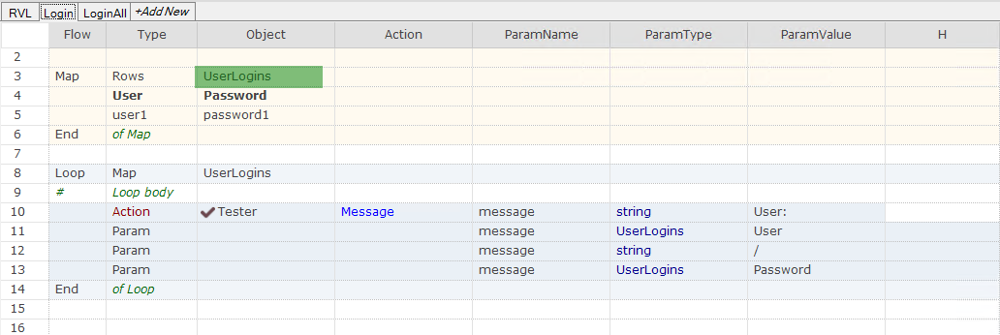

# RVL Sheets

An RVL script may contain one or more sheets distributed across one or more workbooks.

=== "Screenshot"
    
=== "Transcript"
    Workbook with 4 sheets: RVL, Browsers, Users, Login
    
    Active Sheet: RVL

    | Flow | Type | Object | Action      | ParamName | ParamType | ParamValue |
    | ---- | ---- | ------ | ----------- | --------- | --------- | ---------- |
    |      | Action | RVL    | DoPlaySheet | sheetName | string    | Browsers   |

A sheet is an atomic building block for implementing test frameworks and sharing logic.

For example, there may be a sheet called `Login` that can be reused by **CreateNewBook**, **CreateExistingBook**, and other test scenarios that require **Login** logic.

The default sheet name is `RVL`. You can rename it and add more sheets.

An RVL sheet is executable when it has 7 predefined [Columns](Columns.md). A workbook may contain both executable and data sheets.

## Calling Sheets

You can make calls between scripts using [RVL.DoPlayScript](../Libraries/RVL.md#doplayscript) and [RVL.DoPlaySheet](../Libraries/RVL.md#doplaysheet).

## Passing Parameters

You can pass parameters between sheets. See [Passing Input Parameters](RVL_DoPlay.md#passing-input-parameters).

## Passing Maps

You can pass a [Map](Maps.md) between sheets as [input parameters](RVL_DoPlay.md#passing-input-parameters).

For example, here we pass a map `FullLoginData`:

=== "Screenshot"
    
=== "Transcript"
    Sheet name: LoginAll
    
    | Flow | Type   | Object        | Action      | ParamName  | ParamType  | ParamValue    |
    | ---- | ------ | ------------- | ----------- | ---------- | ---------- | ------------- |
    | Map  | Rows   | FullLoginData |             |            |            |               |
    |      | User   | Password      |             |            |            |               |
    |      | user3  | password3     |             |            |            |               |
    |      | user4  | password4     |             |            |            |               |
    |      | user5  | password5     |             |            |            |               |
    | End  | of Map |               |             |            |            |               |
    |      | Action | RVL           | DoPlaySheet | sheetName  | string     | Login         |
    |      | Param  |               |             | UserLogins | expression | FullLoginData |

as a value to override the map `UserLogins` on the `Login` sheet:

=== "Screenshot"
    
=== "Transcript"
    Sheet name: Login
    
    | Flow | Type      | Object     | Action  | ParamName | ParamType  | ParamValue |
    | ---- | --------- | ---------- | ------- | --------- | ---------- | ---------- |
    |      |           |            |         |           |            |            |
    | Map  | Rows      | UserLogins |         |           |            |            |
    |      | User      | Password   |         |           |            |            |
    |      | user1     | password1  |         |           |            |            |
    | End  | of Map    |            |         |           |            |            |
    |      |           |            |         |           |            |            |
    | Loop | Map       | UserLogins |         |           |            |            |
    | #    | Loop body |            |         |           |            |            |
    |      | Action    | Tester     | Message | message   | string     | User:      |
    |      | Param     |            |         | message   | UserLogins | User       |
    |      | Param     |            |         | message   | string     | /          |
    |      | Param     |            |         | message   | UserLogins | Password   |
    | End  | of Loop   |            |         |           |            |            |

## RVL File

The default file format for RVL scripts is an Excel workbook, which makes it easier to combine data with script logic. Any RVL file has the `.rvl.xlsx` extension and can be opened directly in **MS Excel**.