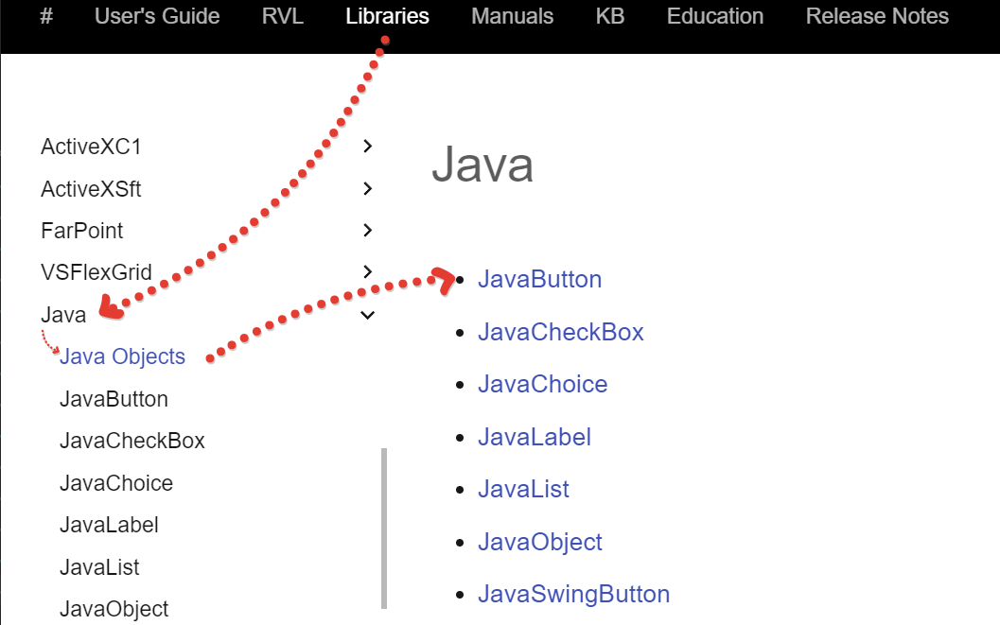
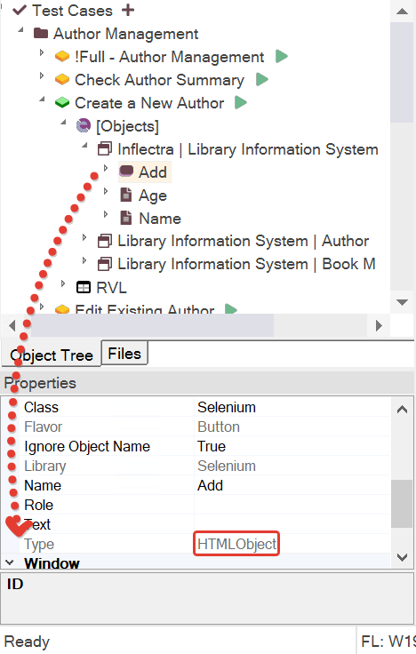
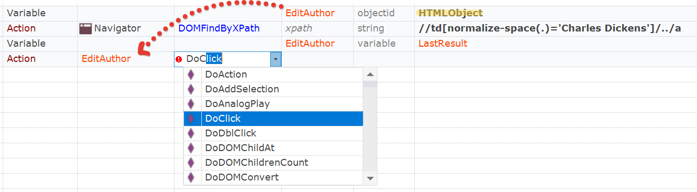
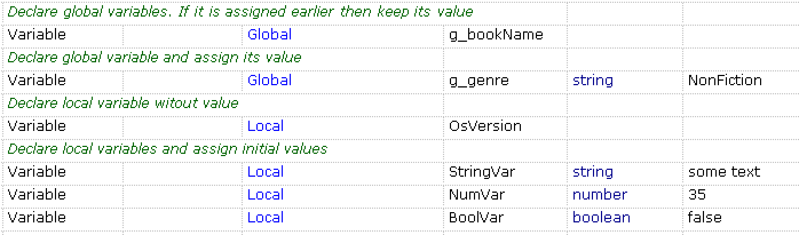

# Variables

In RVL, variables are useful for storing intermediate results as well as accessing and passing global values to external *JavaScript* functions.

Variables may be used in [Params](Params.md) to [Conditions](Conditions.md) and in [Actions](Actions.md).

## Declaring

This line declares a variable without any values. Its value may be assigned later:

*Flow*| *Type*  | *Object*   | *Action*   | *ParamName* | *ParamType* | *ParamValue*
:--   |:--     |:--          |:--         |:--          |:--          |:--
      |**Variable**|         |            |   `MyVar1`   |             |            

## Local Variables

By default declared variables are assumed to be local. Local variables may be used only within the current RVL script and not visible from other RVL scripts or *JavaScript* code.

## Global Variables

You may have a *JavaScript* variable defined in the user *Functions* file (`*.user.js`), i.e.:

```javascript
// Piece from User.js
var globalVar = "Value";
```

Then in the RVL you may declare `globalVar` as global and access it (read or assign values). Declaring a variable as global is simple:

*Flow*| *Type*  | *Object*   | *Action*   | *ParamName* | *ParamType* | *ParamValue*
:--   |:--     |:--          |:--         |:--          |:--          |:--
      |*Variable*|           |**Global**  |`globalVar`  |             | 

Global variables are useful for exchanging and/or sharing data between different RVL scripts or between *RVL* and *JavaScript*.

### Default Value for Global Variable

Special parameter name `defaultValue` of the Global variable definition allows setting default value. This may be needed when you don't know if variable was set before calling this script. So the value will only be assigned is variable is currently undefined. Otherwise the Variable keeps its defined value.


This helps to make sheets using global variables to be executable standalone. I.e. you may use [Play This Sheet](../Guide/rvl_editor.md#context-menu) in RVL and be sure that Global variable will have a value.

## Assigning

### Assignment Expression

This line declares and assigns value *5* to a variable `MyVar2`:

*Flow*| *Type*  | *Object*   | *Action*   | *ParamName* | *ParamType* | *ParamValue*
:--   |:--     |:--          |:--         |:--          |:--          |:--
      |**Variable**|         |            |   `MyVar2`   |   *number*  | *5*           

If the variable is declared earlier, then assignment just changes its value. If the variable is not yet declared, then assignment is actually a declaration with assignment.

### Action Output

If an action returns a value it can be assigned to a variable via `Output`.

*Flow*| *Type*  | *Object*   | *Action*   | *ParamName* | *ParamType* | *ParamValue*
:--   |:--     |:--          |:--         |:--          |:--          |:--
      | **Variable** |         |              | `OsVersion`   |     |      
      | **Action**   | Global  | GetOsVersion |               |     |      
      | **Output**   |         |              |               | variable | OsVersion

### Auto Assignment

There are two auto assigned variables in RVL:  `LastResult` and `LastObject`. If an action returns some value then it is assigned to `LastResult`. `LastObject` is effectively an alias to the last used object in **Object** column.

*Flow*| *Type*  | *Object*   | *Action*   | *ParamName* | *ParamType* | *ParamValue*
:--   |:--     |:--          |:--         |:--          |:--          |:--
      | **Action**   | Global  | GetOsVersion |               |     |      
      | **Action**   | Tester  | Message      |               | variable | **LastResult**

This snippet prints OS version to the report.

## Using

Any [Params](Params.md) value may accept a *variable*:

...|*Type*| ...| *ParamName* | *ParamType*|*ParamValue*
---|----  |----|:--          |:--         | :--
...|Param |    |  text       | *variable* | `MyVar1`           

Any [Params](Params.md) value may accept an *expression* using variables:

...|*Type*| ...| *ParamName* | *ParamType*| *ParamValue*
---|----  |----|:--          |:--         |:--
...|Param |    |  text       |*expression*| `MyVar2 + 4`           

Any [Action](Actions.md) may write its return value to a variable using the *Output* statement:

*Flow*| *Type*| *Object*   | *Action*   | *ParamName* | *ParamType* | *ParamValue*
:--  |:--     |:--         |:--         |:--          |:--         |:--
     | Action | Global     | DoTrim     |  str        | string     |   text to trim              
     | Output |            |            |             | variable   | `MyVar1`          

The Output value may then be used as a param value in actions, conditions, assertions and expressions.

## Variable Actions

One may use an expression to change the value of a variable. Here are several common variable operations that may be used to modify variable values:

1. *Increment* is an operation where numeric value is increased by `1` or any other specified value. The variable must have a numeric value. Otherwise the result is `NaN`.

    If no param to *Increment* is specified then `1` is assumed:

      *Flow*| *Type*  | *Object*   | *Action*   | *ParamName* | *ParamType* | *ParamValue*
      :--   |:--     |:--          |:--         |:--          |:--          |:--
            |*Variable*|           |**Increment**  |`numVar`  |     |  

      Otherwise it is any *value*:

      *Flow*| *Type*  | *Object*   | *Action*   | *ParamName* | *ParamType* | *ParamValue*
      :--   |:--     |:--          |:--         |:--          |:--          |:--
            |*Variable*|           |**Increment**  |`numVar`  | `number`   | *value* 

2. *Decrement* is the same as increment but the value is subtracted from the variable.

3. *Append* adds the value as text to the specified variable. This operation is useful for constructing text messages:

      *Flow*| *Type*  | *Object*   | *Action*   | *ParamName* | *ParamType* | *ParamValue*
      :--   |:--     |:--          |:--         |:--          |:--          |:--
            |*Variable*|           |**Append**  |`textVar`  | `string`   | Final value: 
            |*Variable*|           |**Append**  |`textVar`  | `variable`   | `numVar` 

      In this example if `textVar` was empty and `numVar` had value `5` then the final value of `textVar` is the following text:
      `Final value: 5`

## Variables as Objects

A variable in Rapise can hold an object from the repository, and when it is a repository object, it can have actions that can be executed.

When declaring a variable with the `objectid` *ParamType*, you are indicating to the RVL editor that the variable has either:

1. The type of the object when the `objectid` matches the ID from the object repository.
2. The type by name when the `objectid` matches a well-known object type. You can find object names in the documentation for each library. For example, the topic [Java Objects](/Libraries/ses_lib_java) lists all known object types for the Java library.

      

      Additionally, you can use the type specified in the object's definition properties. For example, most web objects have the type [HTMLObject](/Libraries/HTMLObject), as shown in the object properties:

      

The RVL editor knows how to handle such a variable and provides necessary hints to choose an action for it:



## Examples

Variables may be declared as *Local* or *Global*. Declaration may or may not contain initial value



Variables may accept output from the *Action*:


Variables may be used as input to the *Action*:


